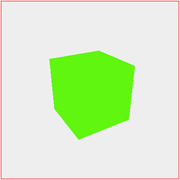
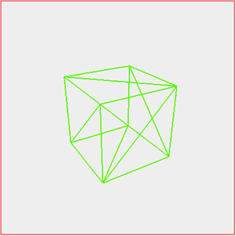
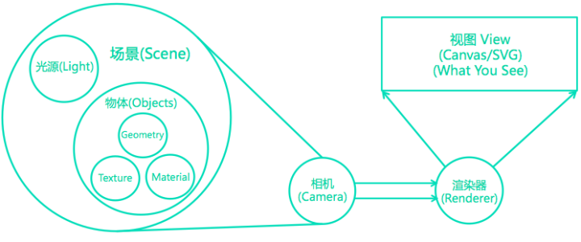
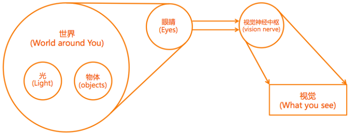

# Three.js开发基础和3D全景（一）

引子

最近在搞web3D全景图，技术上选用了Three.js作为基础，所以写几篇文章跟大家分享一下，主要介绍Three.js的开发基础和基本原理，以及如何实现3D全景图。想在web端实现3D全景图的效果，除了全景图片、WebGL外，还需要处理很多细节。据我所知，目前国外3D全景图比较好的是[KrPano](https://link.zhihu.com/?target=http%3A//krpano.com/)，国内很多3D全景服务是在使用krpano的工具。

### WebGL

根据Khronos对WebGL的定义，WebGL是一套跨平台的针对3D图形API的web标准，借助canvas元素和DOM接口实现3D图形绘制，其基于[OpenGL ES 2.0](https://link.zhihu.com/?target=http%3A//OpenGL%20ES%20-%20The%20Standard%20for%20Embedded%20Accelerated%203D%20Graphics)（OpenGL for Embeded Systems）标准，和openGL ES 2.0规范非常接近。目前，主流浏览器普遍实现了对WebGL的[支持](https://link.zhihu.com/?target=http%3A//Can%20I%20use...%20Support%20tables%20for%20HTML5%2C%20CSS3%2C%20etc)。一言以蔽之，如下：

> WebGL brings plugin-free 3D to the web, implemented right into the browser.
>
> —— Khrono Group

但是，WebGL的入门和开发还是有一定难度的，需要具备一定的图形学基础，代码逻辑比较复杂，代码量较大。比如说使用WebGL要自行处理坐标变换和着色器，大家可以看一下 叶斋 老师的[《WebGL技术储备指南》](https://link.zhihu.com/?target=http%3A//www.atatech.org/articles/21455)。

### Three.js

基于简化WebGL开发复杂度和降低入门难度的目的，[mrdoob](https://link.zhihu.com/?target=http%3A//mrdoob%20(Mr.doob))在WebGL标准基础上封装了一个轻量级的JS 3D库—— [Three.js](https://link.zhihu.com/?target=http%3A//threejs.org/)。在我看来，Three.js具有以下特点：

- 完备 具备3D开发所需完整功能，基本上使用WebGL能实现的效果，用Three.js都能更简单地实现
- 易用 架构设计比较清晰和合理，易于理解，扩展性较好，且开发效率高于WebGL
- 开源 项目开源，且有一批活跃的贡献者， 持续维护升级中

Three.js使WebGL更加好用，可以实现很棒的3D效果，比如：

- 游戏 [hellorun](https://link.zhihu.com/?target=http%3A//HelloRun%E2%84%A2)
- 数据可视化 [armsglobe](https://link.zhihu.com/?target=http%3A//Small%20Arms%20Imports%20%26%20Exports)

### Three.js 开发基础

在开始之前需要引入three.js。

```html
<script src="js/three.min.js"></script>
```

从多个版本之前，three.js就开始将很多辅助功能插件化，如果需要使用这些功能，需要引入相应的资源，例如projector。（本文代码基于的threejs发布版本是r74）

three.js的主要组件包括：

- Scene （场景）
- Material & Texture（材质 & 纹理）
- Geometry（几何）
- Object （物体）
- Light （光线）
- Camera （相机）
- Renderer & Shader (渲染器 & 着色器)
- Loader （加载器）

接下来，我会尽量通俗易懂的为大家介绍这些组件的定义、基本功能、使用和相互关系。

想要实现3D效果，首先要有一个3D场景：

```javascript
var scene = new THREE.Scene();
```

Scene代表一个三维空间，用于容纳和呈现的效果相关的一切，包括物体、灯光等。

通俗来说，可以把Scene想象成一个世界，可以容纳所有物质，只是目前这个世界是空的，也观察不到这个世界。

想要呈现3D物体，需要创建一个物体并加入到Scene中：

```javascript
// 添加物体
var mat = new THREE.MeshBasicMaterial({  // 材质
    color: 0x60f60f
});
var gem = new BoxGeometry(40, 40, 40);  // 几何结构
var obj = new THREE.Mesh(gem, mat);  // 物体
scene.add(obj);
```

创建一个物体需要创建：

- Material(材质)：材质决定物体的呈现效果。three.js支持的材质包括发光材质、不发光材质以及纹理材质等。
- Geometry(几何结构)：几何结构描述的是一个物体的形状，包含一个物体完整的几何信息。three.js支持基本几何体、复合几何体以及导入模型。
- Object3D(物体)：物体即代表一个有效物体，加入到场景(世界)中后就可以被观察到。

继续通俗地说，现在有了一个世界，世界内有了一个物体，但是如果物体的材质无法发光，这个物体是无法被观察到的。此时，我们需要给这个世界加上光（Light）：

```javascript
// 添加自然光源
var light = new THREE.AmbientLight( 0xffffff );
scene.add( light );
```

此时，我们已经创建了一个完整的世界。

但是，想要能够在Web环境下”观察”这个世界，还需要解决两个关键问题:

- 正如人眼只能观察真实世界的某一个方向，我们如何决定3D场景的哪一部分被取景和展示？
- 如何将场景渲染到Web页面上？

three.js中有两个组件专门用来解决这两个问题：

- Camera(相机): 相机的作用便是取景，计算获取整个3D场景中需要被渲染呈现的部分。
- Renderer(渲染器): 将相机取到的部分场景渲染。

首页，在页面上指定一个区域用于展示场景：

```html
<style type="text/css">
#container{
    height:400px;
    width: 400px;
    border: 1px solid red;
}
</style>
<div id="container"></div>
```

之后，用渲染器将场景渲染到对应区域

```javascript
// 基本数据
var container = document.getElementById("container");
var width = container.clientWidth, height = container.clientHeight, fov = 70;
// 创建相机
var camera = new THREE.PerspectiveCamera( fov, width / height, 1, 1000 );
camera.lookAt(new THREE.Vector3( 0, 0, 0 ));
// 创建渲染器
var renderer = new THREE.WebGLRenderer({preserveDrawingBuffer: true});
renderer.setClearColor(0xEEEEEE, 1.0);
renderer.setSize( width, height );
// 渲染
conainer.appendChild(renderer.docElement);
renderer.render(scene, camera);
```

最终我们观察到的效果及其几何结构如下：





总结分析上面啰嗦的一堆介绍，three.js的基本组件关系如下图所示：



如果你感觉还是不好理解各组件的作用和关系，那么我们对照一下真实世界的视觉形成逻辑就更好理解了：



### 小结

本文在简单介绍WebGL和three.js的基础上，对three.js的主要组件的定义、作用、使用方法和组件关系进行了介绍，其中有一些自己的理解，如有不准确之处，请多多指教。

此外，这篇文章比较基础，更加深入的部分将在《Three.js开发基础和3D全景（二）》中介绍。