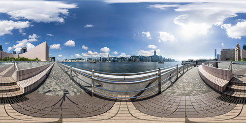

# Three.js开发基础和3D全景（三）

### 前言

通过该系列的[第一篇文章](Threejs开发基础和3D全景一.md)和[第二篇文章](Threejs开发基础和3D全景二.md)，相比大家肯定对WebGL和three.js有基本的了解了，但是文章题目中不是还有个3D全景么，所谓“光说不练假把式”，这一篇文章就跟大家介绍一下3D全景图是怎么实现的。

### 3D全景图是个什么东东

大家可以先感受一下效果：

- [上海外滩全景](https://link.zhihu.com/?target=http%3A//249%E4%BA%BF%E5%83%8F%E7%B4%A0%E4%B8%8A%E6%B5%B7%E5%A4%96%E6%BB%A9%E5%85%A8%E6%99%AF);
- [KrPano主页，可以找到各种全景示例](https://link.zhihu.com/?target=http%3A//krpano.com);

全景图，又称Panorama，根据[Wiki Pedia](https://link.zhihu.com/?target=http%3A//Panorama%20-%20Wikipedia)的定义，是一种宽角度的物理场景视图或展现形式，包括绘画、摄影、电影、震动映像或3D模式等，原文如下：

> A panorama, is any wide-angle view or representation of a physical space, whether in painting, drawing, photography, film, seismic images or a three-dimensional model.
>
> Wiki Pedia

Web 3D全景图即是在Web页面内，以3D的展现形式，将通过某种介质记录（图片&视频）的宽角度（一般是360°）现实场景进行展示和播放。简单说，Web3D全景的核心就是做一个全景图播放器。

在不远的过去，webGL还没有被提出和支持的时候，要想实现3D全景还是要依赖Flash的。随着浏览器，尤其是H5，对webGL的支持，使用JS实现3D全景图具备了可行性。

### 如何实现一个简单的全景图

首先，要引入three.js和一张如下图所示的全景图片：



然后，初始化three.js世界，具体原理请参见系列文章第一篇：

```javascript
// init 3D world    (伪代码)
var world = {};
function initWord(fov, width, height) {
    initScene();  // 场景
    initRenderer();  // 渲染器
    initCamera();  // 摄像机
}
```

然后，向3D世界内添加全景景象：

一般情况下全景图的实现有两种策略：

- 将全景图片切图为6张子图贴到六面体的六个面上
- 将全景图片作为纹理整体贴合到一个球体上

从下面的两张图片中可以看出两者的区别


使用球体的具体实现如下：

```javascript
// 添加全景图
function addPano(url) {
    THREE.ImageUtils.crossOrigin = '';
    // 使用全景图片生成纹理
    THREE.ImageUtils.loadTexture(url, undefined, function(texture) {
        // 设置属性
        texture.maxFilter = THREE.NearestFilter;
        texture.minFilter = THREE.NearestFilter;
        texture.format = THREE.RGBFormat;
        // 从纹理创建材质
        var material = new THREE.MeshLambertMaterial({map: texture});
        // 创建球体，并加入到场景中
        var mesh = new THREE.Mesh( new THREE.SphereGeometry( 955, 50, 50 ), material );
        mesh.scale.x = -1;
        world.scene.add( mesh );
    })
}
```

到此为止，一张全景图已经被绘制到了web页面上，但是你会发现你只能看到全景图的一部分，关于如何让全景图动起来的基本原理和方法可以阅读[上一篇文章](https://link.zhihu.com/?target=http%3A//Three.js%E5%BC%80%E5%8F%91%E5%9F%BA%E7%A1%80%E5%92%8C3D%E5%85%A8%E6%99%AF%EF%BC%88%E4%BA%8C%EF%BC%89%20-%20%E7%9F%A5%E4%B9%8E%E4%B8%93%E6%A0%8F)。

在球体模拟的3D全景场景下，可以使用经纬度坐标和半径来绝对定位空间中的一个点，同时鼠标控制下的摄像机镜头旋转用经纬度变化表示比较方便。

但是最终我们需要将经纬度转换为真实的空间坐标，转换关系如下：


基于此，鼠标操控可以如下实现（伪代码，具体代码可在codePen获取）：

```javascript
 // 重新计算摄像机视觉中心
function refreshCamera(){
    var camera = world.camera, lat = world.lat, lon = world.lon;
    // 控制维度处于－85和85之间
    lat = Math.max( - 85, Math.min( 85, lat ) );
    // 计算竖直夹角弧度 & 计算水平旋转度（弧度）
    var phi = THREE.Math.degToRad( 90 - lat ), theta = THREE.Math.degToRad( lon );
    // 设置相机视角中心点
    camera.target.x = 500 * Math.sin( phi ) * Math.cos( theta );
    camera.target.y = 500 * Math.cos( phi );
    camera.target.z = 500 * Math.sin( phi ) * Math.sin( theta );
    camera.lookAt( camera.target );
}
 // 开启用户控制
function startUserControl(){
    var elem = document.getElementById("container");
    elem.addEventListener("mousedown", function(e){
        // 鼠标按下，开始控制，记录初始位置等信息 
    });
    elem.addEventListener("mousemove", function(e){
        // 鼠标拖动，根据鼠标位置和初始位置计算视图位置
    });
    elem.addEventListener("mouseup", function(e){
        // 鼠标抬起，停止控制
    })
}

// 持续渲染刷新
function anim(){
    requestAnimationFrame(anim);
    refreshCamera();
    world.renderer.render(world.scene, world.camera);
}
```

如此，一个简单的3D全景图就已经实现了，具体的效果请见[codePen](https://link.zhihu.com/?target=http%3A//panodemo)。

### 如果你不仅仅想做一个玩具

一个简单的3D全景图只完成了一个特别糙的架子，仍然属于玩具，如果想要继续深入，可以考虑以下问题：

- 放缩
- 多种控制方式，例如手势控制
- 图片加载动画
- 多场景的管理和切换
- 场景内增加各种物体 & 交互
- 等等

基于此，需要设计一个多层模块化的结果体系来实现全景图，具体结构因为一些原因不便给出，有需要可以交流。

### 小结

到此为止，关于three.js和全景图的介绍就基本结束了，这仅仅是基础和入门的介绍，前方有更精彩的风景，欢迎大家互相交流。