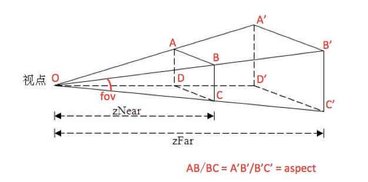

# Three.js开发基础和3D全景（二）

### 前言

[上一篇文章](Threejs开发基础和3D全景一.md)中为大家简单介绍了WebGL和Three.js，并比照真实世界中视觉形成的过程，介绍了Three.js的基本组件及组件关系。如果你能理解上一篇文章的内容，那么恭喜你，你已经可以成为一个世界主了——创建web3D世界。但是：

> World will never be static.（世界永不静止。）

想象一下，如果你以及你眼前的世界变成静止的会是怎样的场景？Incogitable and Horrible! 同样的道理，你所创建Web3D世界也需要动起来。本文将围绕让3D世界动起来这一场景，深入介绍3D开发的一些基本原理和Three.js的相关组件。

### 世界（场景）、观察者和运动

抽象地说：

- 世界是不断变化的整体，世界的每一部分都既是独立的，又是与其他部分相关联的；
- 观察者可以从不同的视角观察世界，比如上帝视角（位于世界之外观察世界）、第一人称视角（作为世界的一部分且以“我”为中心观察这个世界）和第三人称视角（想象你身边一直有双眼睛从固定的角度注视着你和这个世界）；
- 运动是相对的，所以世界需要坐标化；

基于此，想让3D世界动起来可以通过：

- 世界变化
- 观察者(摄像机)运动

首先，由于位置的相对性和运动的相对性，让物体按特定规律运动以及观察和描述物体的运动需要建立坐标系。

- 世界坐标系：又称绝对坐标系。在3D系统中，首先需要的便是世界坐标系，通过世界坐标系可以绝对定位空间内任意一个点。如果以地球来比对，“经纬度+海拔”可以看做绝对坐标系。
- 摄像机坐标系：又称观察者坐标系或相对坐标系，在第一人称游戏中往往也被成为第一人称坐标系或用户坐标系。摄像机坐标系是以摄像机（观察者）为原点建立的坐标系，便于观察、描述和计算摄像机视域内的场景。

在一个世界内会有一个世界坐标系，可能有多个摄像机坐标系，空间中的一个确定点在不同坐标系内的坐标是不同的，从一个坐标计算获得另一个坐标系内坐标的过程叫做坐标变换。坐标变换一般通过矩阵变换实现，对此通常3D库都封装了特定方法。

### 世界变化 & Object3D

在讨论世界变化时，可以将物体作为变化的基本单位，世界的变化可以看做组成世界的各个物体的变化的集合。

物体的变化可以归结为两类：

- 物体本身的变化，包括形变、变色等
- 物体位置的变化，也就是物体的运动

在Three.js中，代表物体的基类是Object3D，该组件提供了对物体变化的基本支持

- 物体变化:
  - Object3D.scale 放缩
  - Object3D.material 获取物体的材质进行调整
  - Object3D.geometry 获取物体的几何体进行调整
- 位置变化:
  - Object3D.rotate 旋转
  - Object3D.transform 位移
  - 通过Object.position 直接改变物体的绝对位置

但是物体的变化规律就需要特定的算法来控制了，否则只能变成四不像。

举个简单的栗子，控制物体在xy平面内绕一点的圆周运动：

```javascript
/**
 * @param obj {Object3D} 物体
 * @param center {Vector3} 中心点坐标
 * @param radius {Number} 半径
 * @param speed {Number} 速度
 */
function circularMotion(obj, center, radius, speed){
    var theta = 0;
    setInterval(function(){
        // 角度变化
        theta = ( theta + speed * 20 ) % 360;
        // 转换为弧度
        var deg = THREE.Math.degToRad(theta);
        // 位置计算
        obj.position.x = center.x + radius * Math.sin(deg);
        obj.position.y = center.y + radius * Math.cos(deg);
    }, 20);
}
```

举个复杂的栗子：物理世界体系内的物体运动模型，包括重力、碰撞模型等。

### 观察者变化 & Camera

观察者的变化同样包含两种：

- 位置变换: 例如文章开始时给出的[Demo](https://link.zhihu.com/?target=http%3A//threejs-rotate)中，就是通过控制观察者位置的变换来实现场景整体的运动效果
- 摄像机属性变换: 和人眼不同，摄像机作为观察者更加精确，同时增加了视角等属性，通过改变这些属性可以获得不同的观察效果

Three.js提供的Camera(摄像机)主要有两种，一种是正交投影相机(Orthographic Camera)，一种是透视投影相机(Perspective Camera)。两种相机的区别在于投影方式：正交投影等同平行投影的效果；透视投影则是一个物体的位置距离相机越远，则视觉体积越小。其中透视投影和人类的视觉感知是一致的。

```javascript
// 创建一个透视投影相机
var fov = 60, aspect = window.innerWidth / window.innerHeight;
var near = 10, far = 1000;
new THREE.PerspectiveCamera(fov, aspect, near, far);
```

其四个主要属性的关系如下图所示：



- near: 近视距，从视点O到近视面ABCD的垂直距离
- far: 远视距，从视点O到远视面A'B'C'D'的垂直距离
- fov: 视线纵向张开角度，任意过视点O的竖切面的顶角，例如角BOC和角A'OD'
- aspect: 代表视线横向展开幅度，等于任意横截面的宽高比，例如AB/BC

这些属性共同确定了摄像机的可视区域，称为视域，渲染器只会渲染摄像机视域内的内容，也就是最终呈现的内容。改动摄像机的position或其他四个属性，视域就会随之改变。通过控制摄像机持续改变位置或其他属性，就可以实现全场景的运动效果。

### 渲染刷新

通过上面的操作可以控制3D世界动起来，但是还需要将发生改变的世界场景实时的渲染到web页面上。这个过程一般通过requestAnimationFrame实现，在性能良好的情况能够达到60FPS的刷新频率。

```javascript
// 持续刷新渲染
function render(){
    /* 添加变换控制：物体变换 & 相机变换*/
    requestAnimationFrame(render);  // 帧动画
    renderer.render(scene, camera);  // 渲染
}
```

### 小结

关于Three.js和3D开发基础的介绍就到此为止了，下一篇文章将为大家呈上3D全景图的开发介绍，敬请期待~