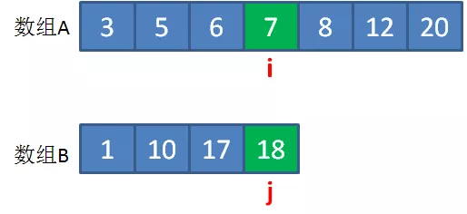

## 漫画：如何找到两个数组的中位数？


**—————  第二天  —————**


什么意思呢？让我们来看两个例子：


上图这两个给定数组A和B，一个长度是6，一个长度是5，归并之后的大数组仍然要保持升序，结果如下：


大数组的长度是奇数（11），中位数显然是位于正中的第6个元素，也就是元素5。


上面的例子是奇数个元素的情况。那么偶数的元素是什么样呢？让我们来看另一个例子：


上图这两个给定数组A和B，长度都是5，归并之后的大数组如下：


大数组的长度是偶数（10），位于正中的元素有两个，分别是6和7，这时候的中位数就是两个数的平均值，也就是6.5。


————————————


或许这听起来有点绕，我们仍然用刚才的例子来说明：


如上图所示，对于偶数长度的数组，可以根据中位数分成长度相等的两部分，左半部分最大元素（6），永远小于等于右半部分的最小元素（7）。


对于奇数长度的数组，同样可以根据中位数分成两部分：


如上图所示，对于奇数长度的数组，如果把中位数本身归入左半部分，则左半边长度 = 右半边长度+1。


左半部分最大元素（5），永远小于等于右半部分的最小元素（6）。


什么意思呢？大数组被中位数等分的左右两部分，每一部分根据来源又可以再划分成两部分，其中一部分来自数组A的元素，另一部分来自数组B的元素：


如图所示，原始数组A和B，各自分成绿色和橙色两部分。其中数值较小的绿色元素组成了大数组的左半部分，数值较大的橙色元素组成了大数组的右半部分。


最重要的是，**绿色元素和橙色元素的数量是相等的（偶数情况），而且最大的绿色元素小于最小的橙色元素。**


假设数组A的长度是m，绿色和橙色元素的分界点是i，数组B的长度是n，绿色和橙色元素的分界点是j，那么为了让大数组的左右两部分长度相等，则i和j需要符合如下两个条件：


**i + j = （m+n+1）/2**

（之所以m+n后面要再加1，是为了应对大数组长度为奇数的情况）


**Max(A[i-1],B[j-1]) < Min(A[i], B[j])**

(直白的说，就是最大的绿色元素小于最小的橙色元素)


由于m+n的值是恒定的，所以我们只要确定一个合适的i，就可以确定j，从而找到大数组左半部分和右半部分的分界，也就找到了归并之后大数组的中位数。


如何利用二分查找来确定i值呢？通过具体事例，让我们来演示一下：


第一步，就像二分查找那样，把i设在数组A的正中位置，也就是让i=3


第二步，根据i的值来确定j的值，j=(m+n+1)/2 - i =3





第三步，验证i和j，分为下面三种情况：


**1.B[j−1]≤****A[i] && A[i−1]≤B[j]**

说明i和j左侧的元素都小于右侧，这一组i和j是我们想要的。

**2****.A[i]<B[j−1]**

说明i对应的元素偏小了，i应该向右侧移动。

**3.A[i−1]>B[j]**

说明i-1对应的元素偏大了，i应该向左侧移动。


显然，对于图中例子，属于情况2，A[3] < B[1]，所以i应该向右移动。


第四步，在数组A的右半部分，重新确定i的位置，就像二分查找一样


第五步，同第二步，根据i的值来确定j的值，j=(m+n+1)/2 - i =1


第六步，同第三步，验证i和j

由于A[5] >= B[0]且B[1]>=A[4]，所以这一组i和j是合适的！


第七步，找出中位数


如果大数组长度是**奇数**，那么：

**中位数 =** **Max(A[i-1],B[j-1])**

(也就是大数组左半部分的最大值)


如果大数组长度是**偶数**，那么：

**中位数 = （****Max(A[i-1],B[j-1]) + Min（A[i], B[i]））/2**

（也就是大数组左半部分的最大值和大数组右半部分的最小值取平均）


在本例中，大数组长度是奇数，所以中位数=Max(8,1) = 8


**1.数组A的长度远大于数组B**


也就是m远大于n，这时候会出现什么问题呢？

当我们设定了i的初值，也就是数组A正中间的元素，再计算j的时候有可能发生数组越界。

因此，我们可以**提前把数组A和B进行交换**，较短的数组放在前面，i从较短的数组中取。

这样做还有一个好处，由于数组A是较短数组，i的搜索次数减少了。


**2.数组A的所有元素都小于数组B，或数组A的所有元素都大于数组B**


这种情况下，最终确定的i值等于0，或最终确定的i值等于0。

如果按照Max(A[i-1],B[j-1])的公式来求中位数，就会出现下标为负数的情况。 

此时求中位数的公式就简化为**A[i-1]或B[i-1]**（假设大数组长度为奇数）


```java
public static double findMedianSortedArrays(int[] arrayA, int[] arrayB) {    
  int m = arrayA.length;    
  int n = arrayB.length;   
  //如果数组A的长度大于等于数组B，则交换数组    
  if (m > n) {        
    int[] temp = arrayA;        
    arrayA = arrayB;        
    arrayB = temp;        
    int tmp = m;        
    m = n;        
    n = tmp;    
  }    
  int start = 0;    
  int end = m;    
  int mid = (m + n + 1) / 2;    
  while (start <= end) {        
    int i = (start + end) / 2;        
    int j = mid - i;        
    if (i < end && arrayB[j-1] > arrayA[i]){
      //i偏小了，需要右移            
      start = i + 1;        
    } else if (i > start && arrayA[i-1] > arrayB[j]) {  
      //i偏大了，需要左移            
      end = i - 1;       
    } else {     
      //i刚好合适            
      int maxLeft;            
      if (i == 0) {               
        //数组A的元素都大于数组B的情况                
        maxLeft = arrayB[j-1];            
      } else if (j == 0) {                
        //数组A的元素都小于数组B的情况                
        maxLeft = arrayA[i-1];            
      } else {                
        maxLeft = Math.max(arrayA[i-1], arrayB[j-1]);            
      }  
      if ( (m + n) % 2 == 1 ) {                
        //如果大数组的长度是奇数，中位数就是左半部分的最大值                
        return maxLeft;            
      }   

      int minRight;            
      if (i == m) {                
        minRight = arrayB[j];            
      } else if (j == n) {
        minRight = arrayA[i];            
      } else {                
        minRight = Math.min(arrayB[j], arrayA[i]); 
      }            
      //如果大数组的长度是偶数，取左侧最大值和右侧最小值的平均            
      return (maxLeft + minRight) / 2.0;        
    }    
  }    
  return 0.0;
}


public static void main(String[] args) {    
  int[] arrayA = new int[]{3,5,6,7,8,12,20};    
  int[] arrayB = new int[]{1,10,17,18};    
  System.out.println(findMedianSortedArrays(arrayA, arrayB));
}
```


—————END—————

