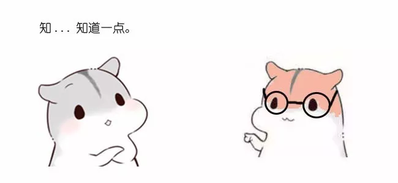
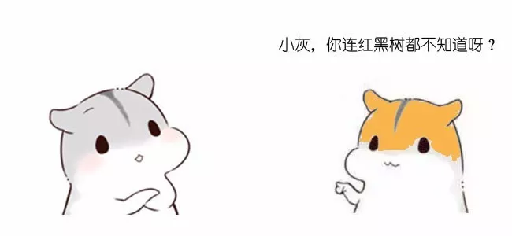
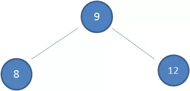

## 漫画：什么是漫画红黑树？

————————————

————————————

二叉查找树（BST）具备什么特性呢？

1.**左**子树上所有结点的值均**小于或等于**它的根结点的值。

2.**右**子树上所有结点的值均**大于或等于**它的根结点的值。

3.左、右子树也分别为二叉排序树。

下图中这棵树，就是一颗典型的二叉查找树：

1.查看根节点**9**：

2.由于**10 > 9**，因此查看右孩子**13**：

3.由于**10 < 13**，因此查看左孩子**11**：

4.由于**10 < 11**，因此查看左孩子**10**，发现10正是要查找的节点：

假设初始的二叉查找树只有三个节点，根节点值为9，左孩子值为8，右孩子值为12：

接下来我们依次插入如下五个节点：7,6,5,4,3。依照二叉查找树的特性，结果会变成什么样呢？

1.节点是红色或黑色。

2.根节点是黑色。

3.每个叶子节点都是黑色的空节点（NIL节点）。

4 每个红色节点的两个子节点都是黑色。(从每个叶子到根的所有路径上不能有两个连续的红色节点)

5.从任一节点到其每个叶子的所有路径都包含相同数目的黑色节点。

下图中这棵树，就是一颗典型的漫画红黑树：

什么情况下会破坏漫画红黑树的规则，什么情况下不会破坏规则呢？我们举两个简单的栗子：

1.向原漫画红黑树插入值为**14**的新节点：

由于父节点15是黑色节点，因此这种情况并不会破坏漫画红黑树的规则，无需做任何调整。

2.向原漫画红黑树插入值为**21**的新节点：

由于父节点22是红色节点，因此这种情况打破了漫画红黑树的规则4（每个红色节点的两个子节点都是黑色），必须进行调整，使之重新符合漫画红黑树的规则。

**变色：**

为了重新符合漫画红黑树的规则，尝试把红色节点变为黑色，或者把黑色节点变为红色。

下图所表示的是漫画红黑树的一部分，需要注意节点25并非根节点。因为节点21和节点22连续出现了红色，不符合规则4，所以把节点22从红色变成黑色：

但这样并不算完，因为凭空多出的黑色节点打破了规则5，所以发生连锁反应，需要继续把节点25从黑色变成红色：

此时仍然没有结束，因为节点25和节点27又形成了两个连续的红色节点，需要继续把节点27从红色变成黑色：

**左旋转：**

**逆时针**旋转漫画红黑树的两个节点，使得父节点被自己的右孩子取代，而自己成为自己的左孩子。说起来很怪异，大家看下图：

图中，身为右孩子的Y取代了X的位置，而X变成了自己的左孩子。此为左旋转。

**右旋转：**

**顺时针**旋转漫画红黑树的两个节点，使得父节点被自己的左孩子取代，而自己成为自己的右孩子。大家看下图：

图中，身为左孩子的Y取代了X的位置，而X变成了自己的右孩子。此为右旋转。

我们以刚才插入节点21的情况为例：

首先，我们需要做的是**变色**，把节点25及其下方的节点变色：

此时节点17和节点25是连续的两个红色节点，那么把节点17变成黑色节点？恐怕不合适。这样一来不但打破了规则4，而且根据规则2（根节点是黑色），也不可能把节点13变成红色节点。

变色已无法解决问题，我们把节点13看做X，把节点17看做Y，像刚才的示意图那样进行**左旋转**：

由于根节点必须是黑色节点，所以需要**变色**，变色结果如下：

这样就结束了吗？并没有。因为其中两条路径(17 -> 8 -> 6 -> NIL)的黑色节点个数是4，其他路径的黑色节点个数是3，不符合规则5。

这时候我们需要把节点13看做X，节点8看做Y，像刚才的示意图那样进行**右旋转**：

最后根据规则来进行**变色**：

如此一来，我们的漫画红黑树变得重新符合规则。这一个例子的调整过程比较复杂，经历了如下步骤：

变色 -> 左旋转 -> 变色 -> 右旋转 -> 变色

**几点说明：**

\1. 关于漫画红黑树自平衡的调整，插入和删除节点的时候都涉及到很多种Case，由于篇幅原因无法展开来一一列举，有兴趣的朋友可以参考维基百科，里面讲的非常清晰。

2.漫画中漫画红黑树调整过程的示例是一种比较复杂的情形，没太看明白的小伙伴也不必钻牛角尖，关键要懂得漫画红黑树自平衡调整的主体思想。

—————END—————