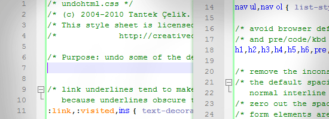
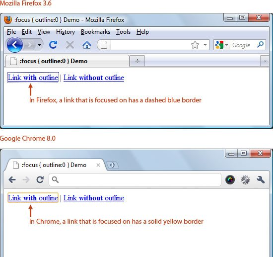

# 重置样式

[你是否需要重置样式](https://www.webfx.com/blog/web-design/should-you-reset-your-css/)

- https://www.webfx.com/blog/web-design/100-exceedingly-useful-css-tips-and-tricks/)

# Should You Reset Your CSS?



This article explores the ongoing debate on whether or not web designers and web developers should reset their CSS, sharing the thoughts and opinions of several web professionals.

This is a three-part series of articles on the topic of CSS resets. After discussing the rich and interesting history of CSS resets ([Part 1](https://www.webfx.com/blog/web-design/the-history-of-css-resets/)) and going over CSS reset stylesheet options ([Part 2](https://www.webfx.com/blog/web-design/a-comprehensive-guide-to-css-resets/)), we will now discuss the pros and cons of using reset stylesheets here in Part 3.

- [Part 1: The History of CSS Reset](https://www.webfx.com/blog/web-design/the-history-of-css-resets/)
- [Part 2: A Comprehensive Guide to CSS Resets](https://www.webfx.com/blog/web-design/a-comprehensive-guide-to-css-resets/)
- [Part 3: Should You Reset Your CSS?](https://www.webfx.com/blog/web-design/should-you-reset-your-css/)

### The Benefits of Resetting Your CSS

Web designer/developer and book author [Morten Rand-Hendriksen](http://www.designisphilosophy.com/) is a huge fan of CSS resets; he has advised everyone to use them as the foundation of their stylesheets. "If you don’t define all the default CSS parameters in your style sheet, the browser will use its default parameters instead," Rand-Hendriksen said in his blog. "And since different browsers have different parameters your site will end up looking different depending on what browser you use."

In an interview by email, [Chris Coyier](http://css-tricks.com/)–a web developer and the founder of the web design community, CSS-Tricks–expressed support for the universal selector margin/padding reset (discussed in [Part 1](https://www.webfx.com/blog/web-design/the-history-of-css-resets/)). He said that all he’s "ever used is `* { margin: 0; padding: 0; }`."

Defending the "hard reset" method, Coyier outlined two main concerns that web designers typically have against using the universal selector.

The first is that it can break web browser default styles for things such as form elements, which he said was "untrue" unless you use a `border:0 `property in the style rule.

The other concern of using the universal selector to reset your styles is the [performance hit](http://code.google.com/speed/page-speed/docs/rendering.html#UseEfficientCSSSelectors) caused by using such an unspecific selector. But Coyier argues that, while this is true technically, "almost all slowdowns that occurs from it is so minuscule that I guarantee nobody will ever notice."

### In Support of No CSS Reset

Web developer [Florent Verschelde](http://covertprestige.net/) made a strong case for not using CSS resets, and instead, suggests that web designers should rely on well-crafted stylesheets to address cross-browser inconsistencies. Verschelde argues that "browser defaults are sensible and useful."

Thanks to the default style rules of web browsers, "your content will always be readable (though not sexy)," according to Verschelde. "If you take them away, you risk having content (say, user-generated content) that ends up being unstyled, raw."

Most designers and developers who believe that browser defaults cause most layout problems are wrong, according to Verschelde. "With sufficient knowledge of CSS, you will realize that most of those things you thought were inconsistencies due to browser defaults are actually caused by poor understanding of the collapsing margins standard mechanism; `hasLayout` bugs in IE 6-7," he said.

Most of the actual inconsistencies crop up in the margins and padding of the `body` element, the margins and padding of lists, and heading font sizes. "If you feel like those few inconsistencies justify setting everything to zero then having to specify the exact margin and padding of most elements in each situation, then do use a reset stylesheet," Verschelde said. For those looking for a different solution, he offered his "no reset" base stylesheet as an alternative.

In 2008, developer/designer Jens Meiert wrote, "reset style sheets are bad: A novice should not use them, an expert would not use them." Meiert justifies his contention by noting that reset stylesheets assign baseline defaults that are just overwritten later on anyway (which makes your CSS inefficient and redundant).

In a blog post titled *No CSS Reset*, developer and book author Jonathan Snook said that he’s "okay if the various browsers show things slightly differently." He likes his "lists to have bullets and strong elements to have bolded text."

Web standards and accessibility advocate, Tommy Olsson, professes that he’s not "a big fan of CSS resets" in an interview via email in late 2010. He said people that use CSS resets are "stuck in a print design mindset," and are continuing to believe in the myth of "Pixel Perfection". He finds CSS reset stylesheets inefficient, because you "provide a lot of rules that you know you’re going to override later."

### Main Concerns with CSS Reset Stylesheets

Russ Weakley pointed out [three major concerns with resetting your CSS](http://www.maxdesign.com.au/articles/css-reset/):

1. Every element that is "zeroed" must then be redefined. This can cause an increase in CSS file size.
2. CSS reset stylesheets can present issues if you remove the default behavior for an element and then forget to restyle it.
3. Some reset stylesheets can be harmful to users who rely on keyboards for navigation.

In a 2010 interview by email, Weakley said that he was surprised when he found that designers and developers used his caveats as evidence that resets should not be used at all. He said that CSS reset stylesheets should be viewed as another tool that designers could use, tweak, and modify to suit their own needs.

### Problems with the Universal Selector

Web developer Dave Ward noted [three problems](http://msdn.microsoft.com/en-us/scriptjunkie/gg257960.aspx) associated with using the universal selector (*).

First, more properties than just margins and padding need to be reset.

Second, the "collateral damage" from the use of the universal selector "wreaks havoc on form styling."

Third, the universal selector "has negative performance implications in almost every scenario, whether a CSS reset or routine CSS styling."

### Unloading on Eric Meyer’s Reset CSS

Eric Meyer’s [Reset CSS](http://meyerweb.com/eric/tools/css/reset/index.html)–perhaps currently the most popular CSS reset stylesheet–has come under fire in more than a few occasions.

It seems that many users failed to read Meyer’s discussions of Reset CSS and just dropped it into their designs without paying attention to the author’s advice that it should be used as "a starting point, not a self-contained black box of no-touchiness."

#### Dissecting Reset CSS

In 2007, web developer Gary Turner dissected Meyer’s Reset CSS, in part, to argue against CSS reset stylesheets in general (read his forum post titled *Global resets considered harmful*). He noted that Reset CSS includes deprecated items (such as `<applet>` and `<center>`) as well as unnecessary/redundant styling of elements that already have no padding or margin (such as `<a>` and ``).

Turner is pretty vocal about his opposition to the entire concept of resets, but his opinions don’t go entirely unopposed. In a [SitePoint forum post](http://www.sitepoint.com/forums/showpost.php?p=4262864&postcount=42), web designer Dan Schulz suggested that "being able to kill the margins on non-form elements" helps a lot.

"It’s a lot like the way the Marine Corps trains its recruits. In order to build up a Marine, you first have to tear down the teen," he said.

#### The Use of :focus in Reset CSS

In a slideshow presentation, Weakley cited the following code as being harmful to keyboard users:

```
:focus {outline: 0}
```

When there is no visual representation of the active element (such as a link), it makes web page navigation difficult for keyboard users because they are unable to see which HTML element they are currently on.



In an email interview, Meyer discussed the `:focus` controversy and said that he didn’t anticipate that people would just use Reset CSS without first understanding how it worked. Regarding the `:focus`style rule, he said: "Honestly, I put it in there to get people to define one. Clearly what I should have done was have outlined 3px solid red or something like that."

"From an accessibility viewpoint the mistake was in mentioning it at all, unfortunately. But on the other hand, you can’t really get away with, ‘Maybe if we don’t mention this, no one will ever notice it.’ They always notice it," Meyer said.

Meyer promised an update to Reset CSS which will probably take the rule out and replace it with a comment reminding its users to define a visible `:focus` style rule.

The importance of making sure that the `:focus` pseudo-class selector has a visual property is such that a website called [outlinenone.com](http://www.outlinenone.com/) has the single mission of warning against setting the `outline`CSS property to `none` or `0` for links. To learn more about this issue, Patrick Lauke has a [tutorial on styling the :focus pseudo-class](http://24ways.org/2009/dont-lose-your-focus).

### The Voices of Moderation

Naturally, there’s a middle ground to this whole thing. In November 2009, author and designer Jason Cranford Teague [examined](http://www.peachpit.com/blogs/blog.aspx?uk=To-CSS-Reset-or-Not-to-CSS-Reset) the issues revolving around resetting CSS and came down firmly in the center. He suggests that the use of resets should be determined by the needs of the web design project.

He noted the same pros and cons others had discussed about the use of resets and concluded that you should keep yours as simple as possible. "Keep it simple, keep it compressed, and keep it at the top," Teague advised.

Meyer himself is quite [evenhanded about the use of resets](http://meyerweb.com/eric/thoughts/2008/04/17/crafting-ourselves/). In April 2008, he wrote: "They’re a starting point. If a thousand people took them and created a thousand different personalized style sheets, that would be right on the money. But there’s also nothing wrong with taking them and writing your own overrides. If that works for you, then awesome. For others, reset styles are more of an impediment. That’s only to be expected; we all work in different ways."

Eric Meyer says that the key is to "evaluate various tools by thinking about how they relate to the ways you do what you do — and then choose what tools to use, and how, and when. That’s the mark of someone who thinks seriously about their craft and strives to do it better."

### Acknowledgements

Thank you to the individuals that contributed to this three-part series on CSS resets.

- Faruk Ate?
- [Tantek Çelik](http://tantek.com/)
- [Richard Clark](http://richclarkdesign.com/)
- [Chris Coyier](http://css-tricks.com/)
- [Alex Dawson](http://www.hitechy.com/)
- [Nate Koechley](http://nate.koechley.com/)
- Andrew Krespanis
- [Eric Meyer](http://meyerweb.com/)
- [Paul O’Brien](http://www.pmob.co.uk/)
- Tommy Olsson
- [Russ Weakley](http://www.maxdesign.com.au/)
- My friends and colleagues on the [SitePoint forums](http://www.sitepoint.com/forums)

### CSS Reset Resources and Tools

- CSS Negotiation and a Sanity Saving Shortcut
- [CSS Tools: Reset CSS](http://meyerweb.com/eric/tools/css/reset/)
- [Starting with CSS: revisited](http://web.archive.org/web/20051029075519/kurafire.net/log/archive/2005/07/26/starting-css-revisited)
- [HTML5 Reset Stylesheet](http://html5doctor.com/html-5-reset-stylesheet/)
- [Undoing html.css and using debug scaffolding](http://tantek.com/log/2004/09.html#d06t2354)
- [undohtml.css](http://tantek.com/2010/undohtml.css) (2010)
- YUI 3 Library

### Related Content

- [Resetting Your Styles with CSS Reset](https://www.webfx.com/blog/web-design/css-tip-1-resetting-your-styles-with-css-reset/)
- [Structural Naming Convention in CSS](https://www.webfx.com/blog/web-design/css-tip-2-structural-naming-convention-in-css/)
- [100 Exceedingly Useful CSS Tips and Tricks](https://www.webfx.com/blog/web-design/100-exceedingly-useful-css-tips-and-tricks/)