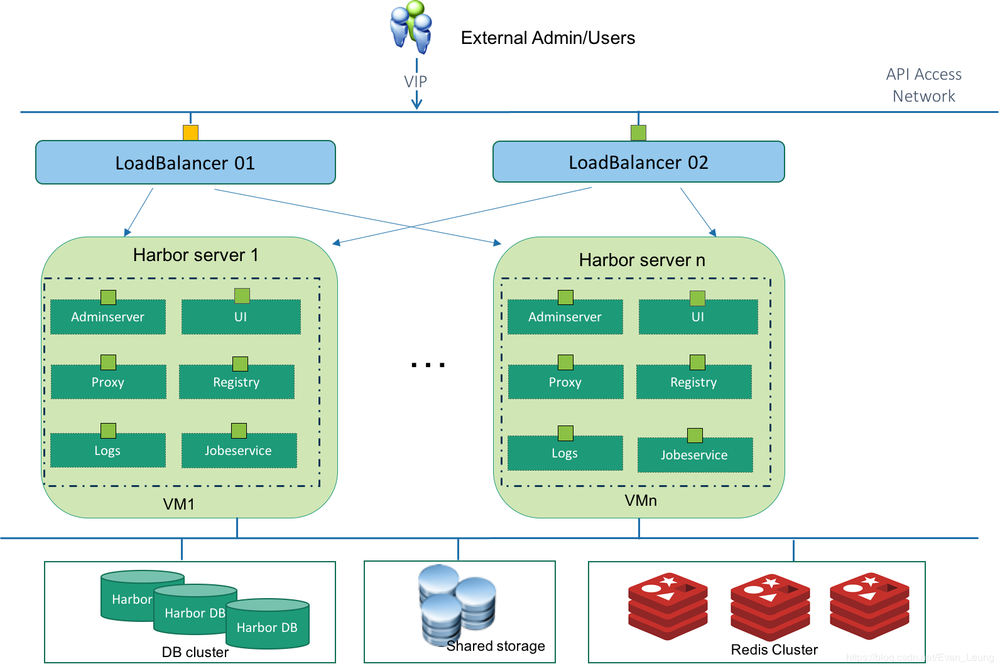
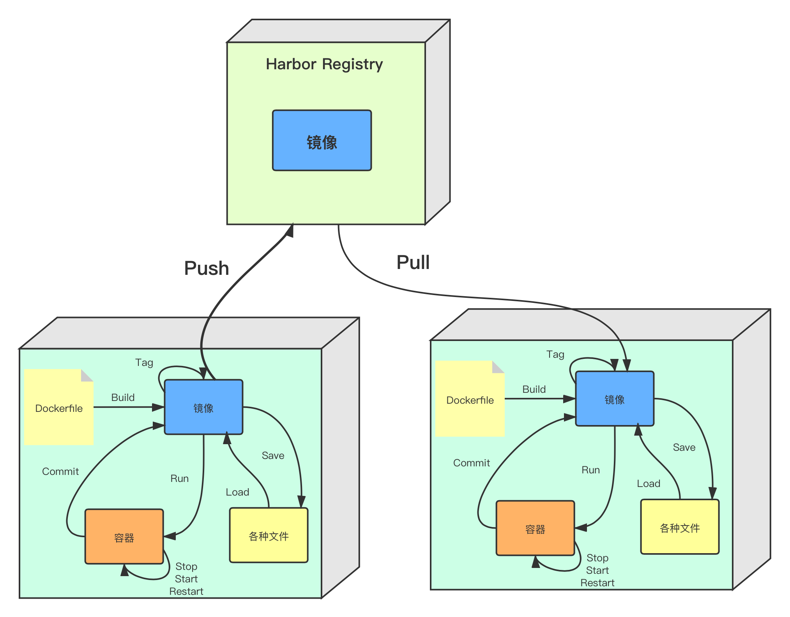
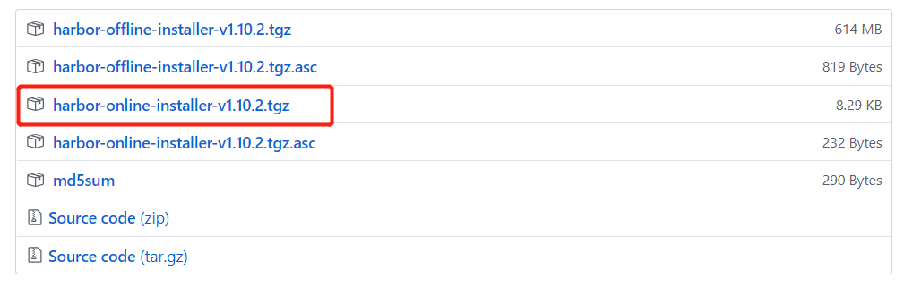
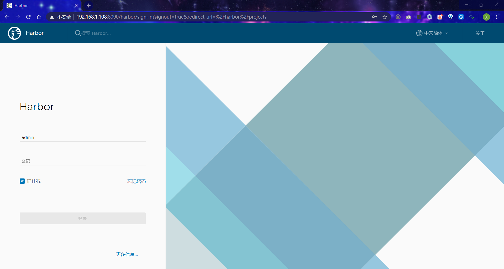
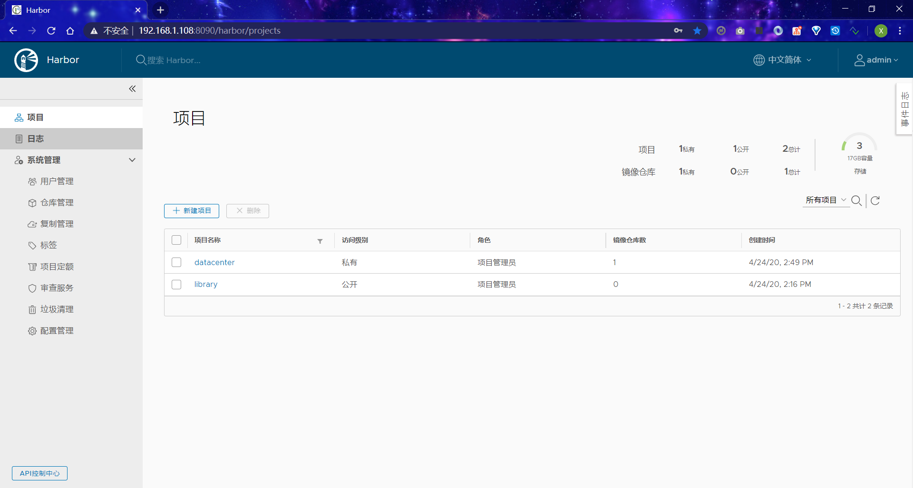
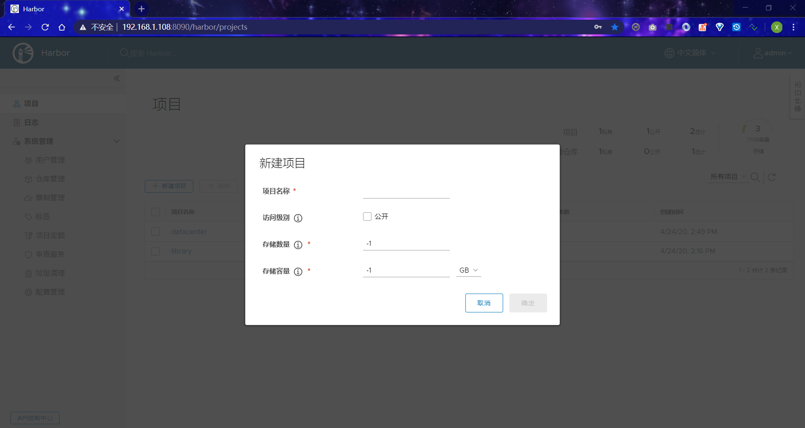
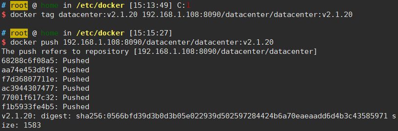
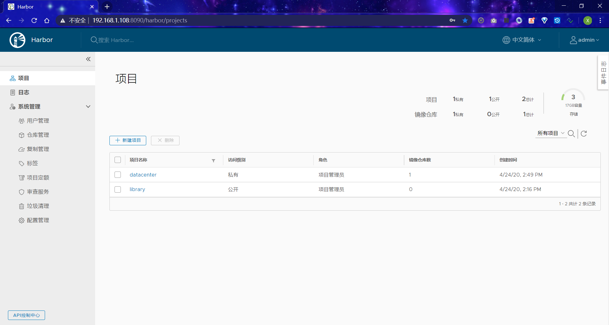
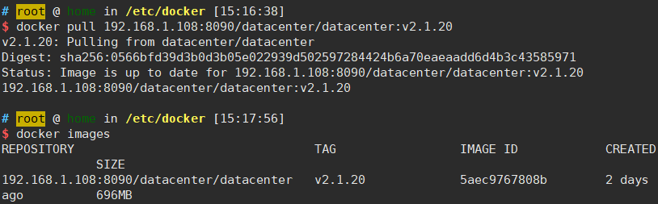

# Harbor搭建本地docker镜像服务器

> Docker已经上市很多年，不是什么新鲜事物了，很多企业或者开发同学以前也不多不少有所接触，但是有实操经验的人不多，本系列教程主要偏重实战，尽量讲干货，会根据本人理解去做阐述，具体官方概念可以查阅官方教程，因为本系列教程对前一章节有一定依赖，建议先学习前面章节内容。

教程目的：

- 了解harbor是什么&为什么要用harbor
- 了解harbor的搭建流程
- 了解harbor的基本操作

------

## 1 Harbor基本概念

[](https://img-blog.csdnimg.cn/20200317213450795.png?x-oss-process=image/watermark,type_ZmFuZ3poZW5naGVpdGk,shadow_10,text_aHR0cHM6Ly9ibG9nLmNzZG4ubmV0L0V2YW5fTGV1bmc=,size_16,color_FFFFFF,t_70)

### 1.1 Harbor是什么

**官方概念：** Harbor是一个开放源代码容器映像镜像表，可通过基于角色的访问控制来保护镜像，扫描镜像中的漏洞并将镜像签名为受信任。 作为CNCF孵化项目，Harbor提供合规性，性能和互操作性，以帮助您跨Kubernetes和Docker等云原生计算平台持续，安全地管理镜像。

简单来说，Harbor就是一个开源的镜像管理仓库，类似Github一样，可以让我们存放一些镜像文件

更多详细内容，可以查看[Harbor 官方文档](https://goharbor.io/docs/1.10/working-with-projects/working-with-images/pulling-pushing-images/)

### 1.2 为什么要用

有动手跟着我前面教程练习的同学应该都有感受，之前的Springboot项目每次都需要在服务器创建镜像，当我有多台服务器需要用到这个镜像，我还得重复在每台服务器上创建一次，那有没有一个中间存储服务帮我们管理这些镜像，让所有的服务器可以共享这个镜像文件呢？Harbor的作用就是帮我们管理镜像，采用分布式架构，让我们可以在任意服务器拉去我们构建好的镜像文件。然后又会有人问我们不是已经有`docker hub`或者 `docker hub`这些远程仓库了吗？确实，但是当我们需要搭建一些私有镜像仓库，不想把公司项目对外公开的时候，Harbor就很有用了，就像很多公司也会在自己公司搭建私有的nexus服务器来管理公司内部的应用package。
[](https://img-blog.csdnimg.cn/20200317233301687.png?x-oss-process=image/watermark,type_ZmFuZ3poZW5naGVpdGk,shadow_10,text_aHR0cHM6Ly9ibG9nLmNzZG4ubmV0L0V2YW5fTGV1bmc=,size_16,color_FFFFFF,t_70)

------

## 2 搭建Harbor镜像仓库
### 2.0 前提  安装docker和docker-compose

安装docker请参考《docker的安装》

安装docker-compose，两种最新的docker安装方式

1.从github上下载docker-compose二进制文件安装
下载最新版的docker-compose文件 

```shell
sudo curl -L https://github.com/docker/compose/releases/download/1.16.1/docker-compose-`uname -s`-`uname -m` -o /usr/local/bin/docker-compose
```


 若是github访问太慢，可以用daocloud下载

```shell
sudo curl -L https://get.daocloud.io/docker/compose/releases/download/1.25.1/docker-compose-`uname -s`-`uname -m` -o /usr/local/bin/docker-compose
```


添加可执行权限 

```shell
sudo chmod +x /usr/local/bin/docker-compose
```

测试安装结果

```shell
docker-compose --version
```

2.pip安装

```shell
sudo pip install docker-compose
```


### 2.1 下载

到github选择一个`harbor`release版本下载
`https://github.com/goharbor/harbor/releases/tag/v1.10.2`



### 2.2 上传到服务器

上传到linux服务器，解压

```shell
tar -vfx harbor-online-installer-v1.10.2.tgz
ls harbor
common.sh  harbor.yml  LICENSE  install.sh  prepare
```

上面是harbor应用解压后的文件

### 2.3 修改harbor配置

修改harbor配置文件
harbor.yml

```
#设置域名
hostname: 192.168.1.108

#设置http参数
# http related config
http:
  # port for http, default is 80. If https enabled, this port will redirect to https port
  port: 8090
  
#设置管理员密码
harbor_admin_password: 1234.abcD

#屏蔽https
#https:
  # https port for harbor, default is 443
  # port: 443
```

上面修改了hostname为我虚拟机的ip，端口把默认`80`端口替换成`8090`，并且修改了管理员密码为`1234.abcD`。需要注意，我这里屏蔽了`https`，如果大家需要开启`https`，需要配置证书和key到指定位置。

### 2.4 开启Docker Http访问权限

Docker默认是不支持http访问注册表，否则后面使用docker去访问harbor服务，会报如下错误：

```shell
http: server gave HTTP response to HTTPS client
```

这里需要先修改下`/etc/docker/daemon.json`配置，加入以下配置(注意是加需要拉取镜像的服务器的配置而不是docker服务器，本机修改`192.168.1.109`服务器上的配置)

```json
{
  "insecure-registries" : ["192.168.1.108:8090"]
}
```

重启docker服务

```shell
systemctl restart docker
```

### 2.5 启动Harbor应用

假如没有`Docker`环境，`harbor`会启动报错

```shell
[root@docker-server harbor]# sh install.sh 

[Step 0]: checking if docker is installed ...

Note: docker version: 19.03.7

[Step 1]: checking docker-compose is installed ...

Note: docker-compose version: 1.25.0

[Step 2]: loading Harbor images ...
Cannot connect to the Docker daemon at unix:///var/run/docker.sock. Is the docker daemon running?
```

需要先安装`Docker`和`docker-compose`组件，这里就不多说了，大家可以参考前面章节的安装教程

当启动Docker后，执行`install.sh`会自动完成安装

```shell
[root@docker-server harbor]# sh install.sh 
...
Creating network "harbor_harbor" with the default driver
Creating harbor-log ... done
Creating harbor-portal ... done
Creating registry      ... done
Creating redis         ... done
Creating harbor-db     ... done
Creating registryctl   ... done
Creating harbor-core   ... done
Creating nginx             ... done
Creating harbor-jobservice ... done
✔ ----Harbor has been installed and started successfully.----
```

上面显示已经安装成功了

### 2.6 访问Harbor应用

在浏览器输入上面我们配置的ip和端口`192.168.1.108:8090`，就会看到`harbor`登陆页面




### 2.7 登陆Harbor

这里使用我们上面的定义的密码登陆

- 账号 - `admin`
- 密码 - `1234.abcD`



------

## 3 创建你第一个Harbor项目
### 3.1 创建项目

点击`New`会进入项目创建对话框，这里填入项目名称即可


### 3.2 在使用Docker登陆Harbor

在使用Harbor之前，要在docker环境登陆Harbor服务

```shell
docker login 192.168.1.108:8090
Username: admin
Password: 1234.abcD
WARNING! Your password will be stored unencrypted in /root/.docker/config.json.
Configure a credential helper to remove this warning. See
https://docs.docker.com/engine/reference/commandline/login/#credentials-store

Login Succeeded
```

### 3.3 对现有的Image打Tag

1. 查看现有的Image，这里我在前面教程已经创建了一些image

```shell
docker images
```

1. 这里我选择`datacenter:v2.1.20`打个标签，新标签为`192.168.1.108:8090/datacenter/datacenter:v2.1.20`

```shell
docker tag datacenter:v2.1.20:192.168.1.108:8090/datacenter/datacenter:v2.1.20
```

### 3.4 发布Image到Harbor

1. 使用Harbor的ip地址和前面创建好的项目名称`credit-facility`进行发布

```shell
docker push 192.168.1.108:8090/datacenter/datacenter:v2.1.20
```



从上面显示结果可以看到，我们已经成功上传镜像到Harbor仓库了




### 3.5 拉取Image到服务器

1. 从Harbor仓库拉去镜像

```shell
docker pull 192.168.101.11:8090/credit-facility/credit-facility-image:latest
```

镜像已经拉取成功。

2. 在查看本地镜像列表验证下

```shell
docker images
```



我们的镜像已经成功安装到本地了，这样即便我们以后换了一台服务器，也可以随时从Harbor仓库拉取镜像，不需要依赖本地服务器。

