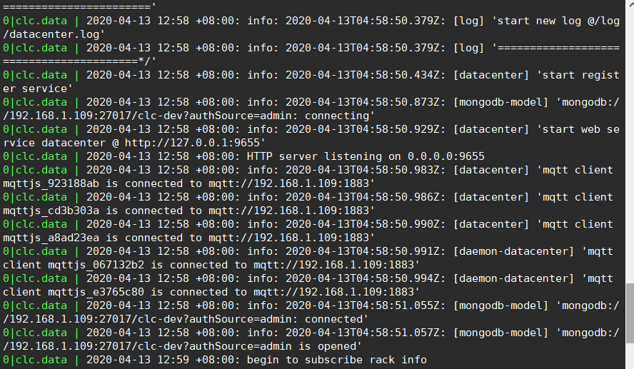

# 生成docker镜像


## 1. 本地生成docker镜像

### 1.1.1  本地打包

```shell
# 1.更改npm源
npm config set config registry="http://clcdata.com:4873"
# 2.全局安装打包工具clc.deployment
npm i clc.deployment -g
# 3.屏蔽上传到服务器的代码，保存到本地

# 4.切换到待打包的项目根目录中，执行打包命令
clc-deploy
```


### 1.1.2  本地生成docker镜像

```shell
# 生成镜像
docker build -t datacenter:0.0.1 .
# 运行容器
docker run -d --name datacenter  datacenter:0.0.1 
```

查看日志：

```shell
docker exec -it datacenter sh
> pm2 logs
```




