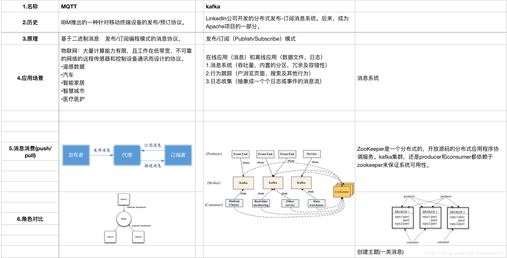
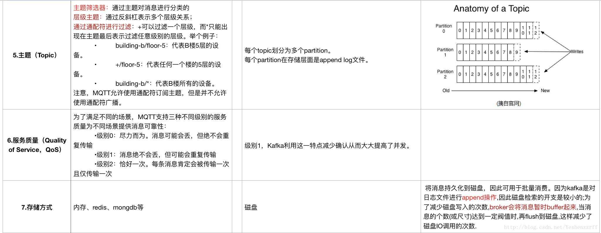
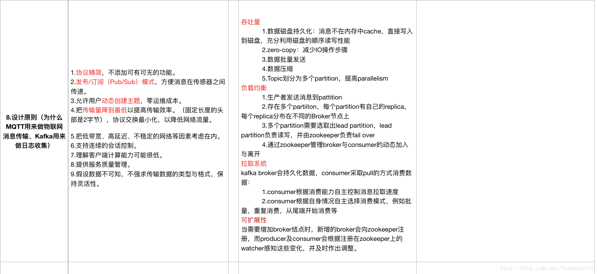
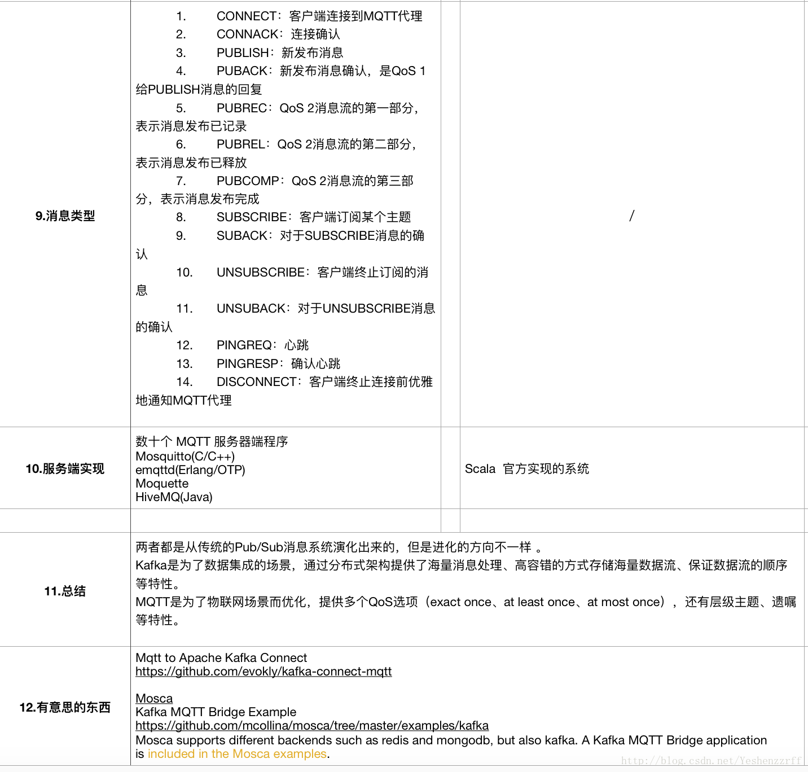

# MQTT与kafka对比分析

## 对比

## 总结：

两者都是从传统的Pub/Sub消息系统演化出来的，但是进化的方向不一样 。                                                                             Kafka是为了数据集成的场景，通过分布式架构提供了海量消息处理、高容错的方式存储海量数据流、保证数据流的顺序等特性。

MQTT是为了物联网场景而优化，提供多个QoS选项（exact once、at least once、at most once），还有层级主题、遗嘱等特性。

## 有意思的东西：

### [Mqtt to Apache Kafka Connect](https://github.com/evokly/kafka-connect-mqtt)

### [Mosca](https://github.com/moscajs/mosca)

### [ Kafka MQTT Bridge Example](https://github.com/mcollina/mosca/tree/master/examples/kafka)

Mosca supports different backends such as redis and mongodb, but also kafka. A Kafka MQTT Bridge application is included in the [Mosca examples](https://github.com/moscajs/mosca/tree/master/examples/kafka).

