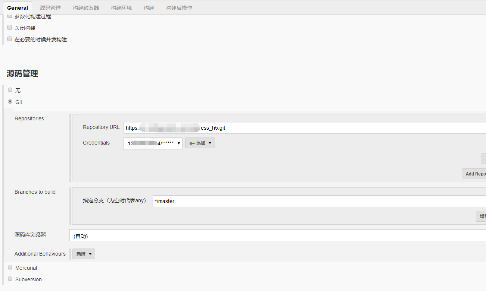

#  docker下安装jenkins

## 1. 安装jenkins服务

1. 在命令行下运行如下命令（本地没有源会自动在官网下载）：

```shell
docker run \
  -d \
  --name jenkins \
  #--rm \
  -u root \
  -p 8080:8080 \
  -v /root/jenkins-home:/var/jenkins_home \
  -v /var/run/docker.sock:/var/run/docker.sock \
  jenkinsci/blueocean
```

找到密码：

```shell
# root @ home in ~/jenkins-home/secrets [11:14:38] 
$ cat initialAdminPassword 
103dcae28f724bd8a37e2cd3b9cb46b5
```

在浏览器中输入 `http://192.168.1.110:8080`，如下图所示，将上一步复制的密码（103dcae28f724bd8a37e2cd3b9cb46b5）粘贴到输入框中：


## 2. 配置node环境

 jenkins 安装必须插件

   NodeJS Plugin

   Publish Over SSH

1：新建一个任务，选择构建一个**自由风格的软件项目**

   

2：源码管理选择Git

   2.1 填写Git项目地址Repository URL

   2.2 配置Git账户密码【Credentials】通过右侧添加

  

 

3： 构建触发器 

   这边暂时没有配置，根据各自需求

4： 构建环境配置

   选择 Provide Node & npm bin/ folder to PATH

   设置 NodeJS Installation（**这边下拉没有选项的话要去 系统管理--》全局工具配置--》NodeJS 配置 ，但是实际配置是无效(PS:不知道是不是我自己问题)，后后面构建时候是报错【env: ‘node’: No such file or directory】，需要手动安装Node程序** ）

   **docker jenkins 手动安装Node 教程：**

```shell
# 1. 进入jenkins对应容器中
docker exec -it [对应容器id] bash

# 2. Alpine里面配置node环境
# 安装nodejs
apk add --no-cache nodejs
apk add --no-cache npm
# 检查node
node -v 
npm -v
# 全局安装其他node包
npm i -g nrm
npm i -g yarn
npm i -g pm2
```


   

 

5： 构建配置

   增加构建步骤选择执行 shell

  

  输入命令：

   ```shell
 npm install
 npm run build:prod
   ```

  

 

 6：构建后操作

   项目实际访问地址不是当前打包的目录，需要把文件拷贝到正式的目录中去

   增加构建后操作步骤

   

 

   选择linux服务器（SSH Server）没有需要先去 系统管理--》系统配置 Publish over SSH（**需要先安装插件**） 中配置服务器信息

   

   

## 3.  配置目录


```shell
#!/bin/bash -ilex
package="datacenter"
cur_path=`pwd`
ver=0.0.3

cd "../dockerfile-iot/$package"

echo `pwd`
docker build -t $package:v$ver .
cd "$cur_path"
docker save $package:v$ver -o ./$package:v$ver.tar
#zip ${package}_v$ver.zip $package:v$ver.tar
#rm -f $package:v$ver.tar

docker tag $package:v$ver home-centos7-mini:8000/docker/$package:v$ver
#docker login -u docker -p sunmoon
#docker push docker.huayuan-iot.com:5000/docker/$package:v$ver
```

如下所示：


构建成功如下图示：


配置node环境

nrm环境

安装依赖包