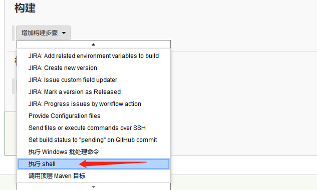

#  docker下安装jenkins

## 1. 安装jenkins服务

1. 在命令行下运行如下命令（本地没有源会自动在官网下载）：

```shell
docker run \
  -d \
  --name jenkins \
  #--rm \
  -u root \
  -p 8080:8080 \
  -v /root/jenkins-home:/var/jenkins_home \
  -v /var/run/docker.sock:/var/run/docker.sock \
  jenkinsci/blueocean
```

找到密码：

```shell
# root @ home in ~/jenkins-home/secrets [11:14:38] 
$ cat initialAdminPassword 
103dcae28f724bd8a37e2cd3b9cb46b5
```

在浏览器中输入 `http://192.168.1.110:8080`，如下图所示，将上一步复制的密码（103dcae28f724bd8a37e2cd3b9cb46b5）粘贴到输入框中：


## 2. 配置node环境

 手动配置node环境：

```shell
# 1. 进入jenkins对应容器中
docker exec -it [对应容器id] bash

# 2. Alpine里面配置node环境
# 安装nodejs
apk add --no-cache nodejs
apk add --no-cache npm
# 检查node
node -v 
npm -v
# 全局安装其他node包
npm i -g nrm
nrm use taobao
npm i -g yarn
npm i -g pm2
```

## 3.  配置目录

将"dockerfile-iot"整个目录放在jenkis-home下的workspace目录下，如下图所示：


## 4. 创建任务

### 4.1 新建一个任务，选择构建一个自由风格的软件项目

### 4.2  构建配置

   增加构建步骤选择执行 shell

  

### 4.3 配置shell脚本，执行构建

#### 4.3.1 半自动构建(手动配置目录，手动输入版本号，需要自己维护版本号)

1. 半自动打包，将打包好的文件按照对应的文件夹命名及目录结构，如下图所示：


  输入命令：

```shell
#!/bin/bash -ilex
package="datacenter"
cur_path=`pwd`
ver=0.0.3

cd "../dockerfile-iot/$package"

echo `pwd`
docker build -t $package:v$ver .
cd "$cur_path"
docker save $package:v$ver -o ./$package:v$ver.tar
#zip ${package}_v$ver.zip $package:v$ver.tar
#rm -f $package:v$ver.tar

docker tag $package:v$ver home-centos7-mini:8000/docker/$package:v$ver
#docker login -u docker -p sunmoon
#docker push docker.huayuan-iot.com:5000/docker/$package:v$ver
```

如下所示：


执行构建，构建成功如下图示：


#### 4.3.2 从npm服务器拉取打包好的包然后构建成docker镜像

无需自己复制文件到对应目录，版本号自动获取，自动从npm服务器拉取，配置文件如下：

```shell
#!/bin/bash -ilex
package="datacenter"
cur_path=`pwd`
cd "../dockerfile-iot/$package"

if [ -d "./node_modules" ];then
rm -rf node_modules
else
echo "node_modules文件夹不存在"
fi

../deploy.js clean
rm -rf yarn.lock
yarn add clc.$package --save --registry http://192.168.1.109:4873
ver=`../deploy.js --semver=clc.$package`

docker build -t $package:v$ver .
cd "$cur_path"
docker save $package:v$ver -o ./$package:v$ver.tar
#zip ${package}_v$ver.zip $package:v$ver.tar
#rm -f $package:v$ver.tar

#docker tag $package:v$ver docker.huayuan-iot.com:5000/docker/$package:v$ver
#docker login -u docker -p sunmoon
#docker push docker.huayuan-iot.com:5000/docker/$package:v$ver

#../dockerfile-iot/deploy.js --docker=$package:v$ver
```

#### 问题：

在同一台主机上部署jenkins服务和verdaccio服务，报错如下：


#### 解决办法：

将verdaccio服务部署在109服务器上，再次构建，成功，如下图所示：


查看生成的datacenter镜像：

在jenkins内部查看保存的镜像文件：


在主机上查看：


在工作空间中查看：


运行容器：

