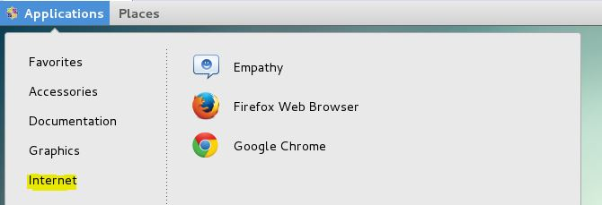
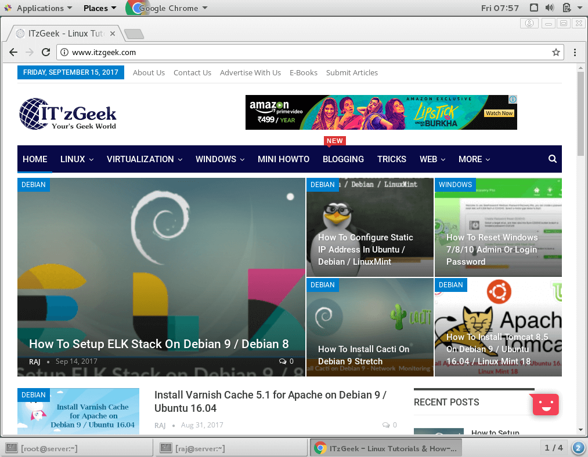

# Install Google Chrome on CentOS 7 / RHEL 7

[**Google Chrome**](https://www.google.com/chrome) is the freeware web **browser** developed by Google that uses the WebKit fork blink engine. As of July Google Chrome is the most widely used browser having, it shares around 56% worldwide browser usage.

Google Chrome has the inbuilt translate faculty for translation of over 52 languages. Google Chrome has the option to install extension and web application to increase the feature and functionality of the browser; you can also install themes for a visual change.

Here is the tutorial about installing latest **Google** Chrome (Currently v65) on **CentOS 7** / **RHEL 7**.

## Requirement

Open a terminal (**Applications** >> **System Tools** >> **Terminal**) and then switch to the root user.

```bash
$ su
```

## Add Google Chrome Repository

Create a repo file under **/etc/yum.repos.d/** directory.

```
vi /etc/yum.repos.d/google-chrome.repo
```

Copy and paste the below repository information to the above repo file.

```ini
[google-chrome]
name=google-chrome
baseurl=http://dl.google.com/linux/chrome/rpm/stable/x86_64
enabled=1
gpgcheck=1
gpgkey=https://dl-ssl.google.com/linux/linux_signing_key.pub
```

## Install Google Chrome on CentOS 7

You can install Google Chrome using yum command on **CentOS 7 / RHEL 7**.

```bash
yum install -y google-chrome-stable
```

**Want to try Google Chrome beta, run:**

```bash
yum install -y google-chrome-beta
```

## Access Google Chrome

Start Google Chrome (**Applications** >> **Internet** >> **Google Chrome**).

**Note**: Google Chrome can not be run as root (**Tutorial about running Google Chrome as root**).

Install Google Chrome on CentOS 7 – Google Chrome Start Menu

**OR**

```bash
$ google-chrome
```

**Google Chrome beta:**

```bash
$ google-chrome-beta
```

**Screenshot of Google Chrome running on CentOS 7 / RHEL 7**.

Install Google Chrome on CentOS 7 – Google Chrome Running on CentOS 7

That ‘s All.

