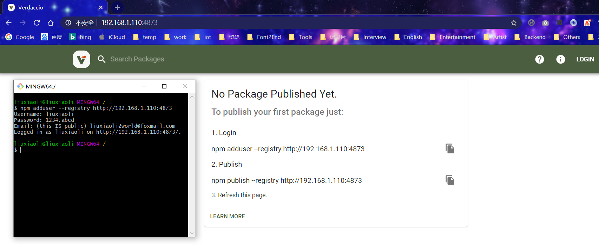
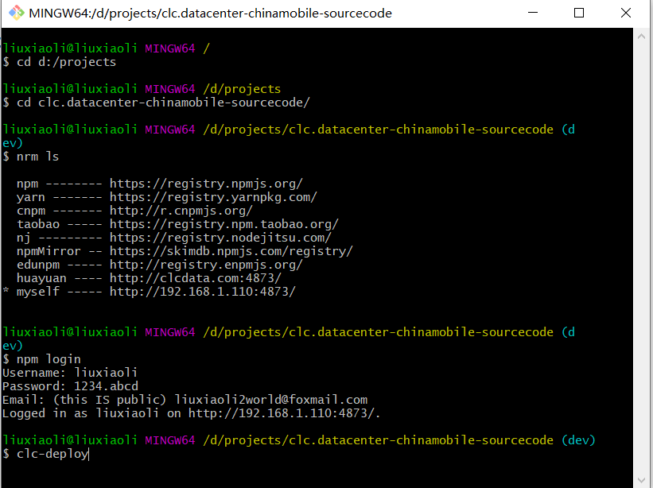
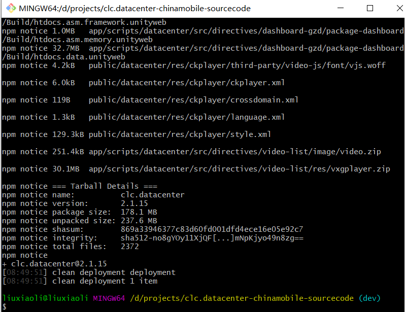
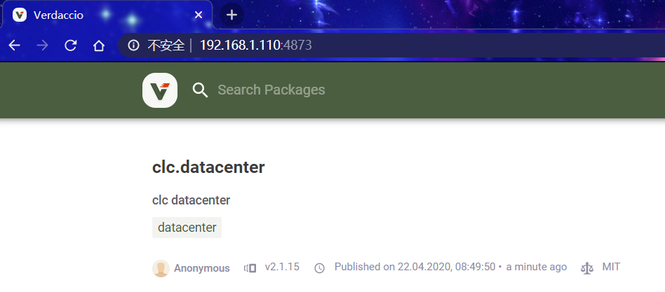
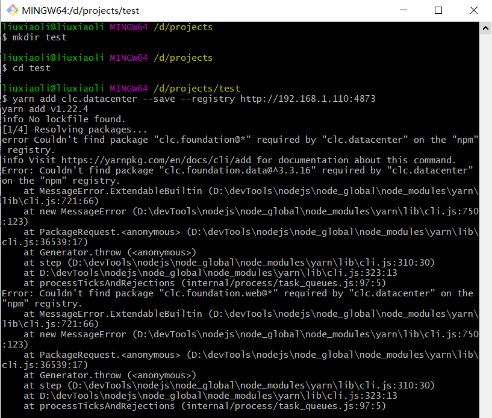
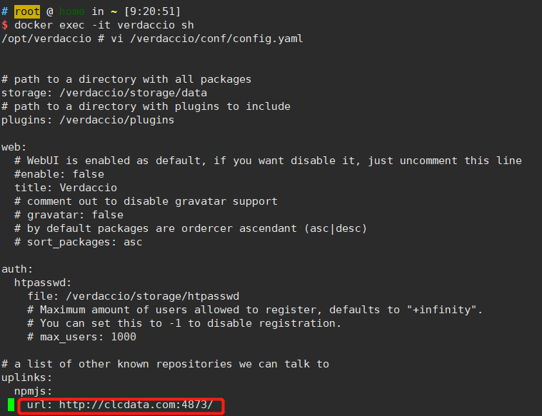
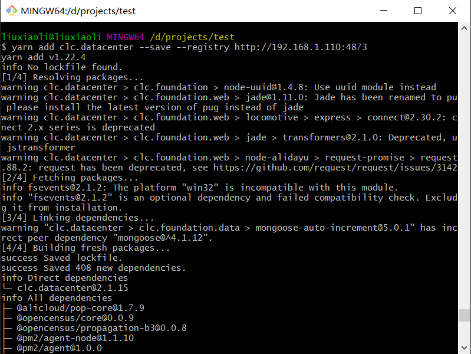
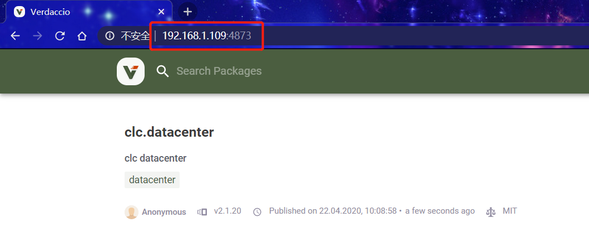

# sinopia/verdaccio

>  sinopia 在15年的时候就停止更新了，继而由 [verdaccio](https://github.com/verdaccio/verdaccio) 提供更新升级，两者用法基本上都是一致的。对于企业级的应用来说，技术选型时请慎重选择sinopia，建议选择verdaccio。

## 1. 拉取docker镜像，运行docker容器

```shell
# 拉取镜像
docker pull verdaccio/verdaccio
# 运行容器（--rm表示临时，退出时会删除容器，-u root表示以root用户登录，否则无法修改config.yaml）
docker run -d --rm -u root --name verdaccio -p 4873:4873 verdaccio/verdaccio
# 运行容器（退出时不会删除容器）
docker run -d -u root --name verdaccio -p 4873:4873 verdaccio/verdaccio
```

## 2. 新增用户（注意：新增用户需在本地进行，否则无权限提交！）

```shell
npm adduser --registry http://192.168.1.110:4873
username: liuxiaoli
password: 1234.abcd
```

如下图所示：



## 3. 问题及解决方案

```shell
docker exec -it verdaccio sh
vi /verdaccio/conf/config.yaml
```

修改配置如下：

```ini
# error 413 Payload Too Large - PUT http://192.168.1.110:4873/clc.datacenter - request entity too large
max_body_size: 3000mb

# error 503 Service Unavailable - PUT http://192.168.1.110:4873/clc.datacenter - one of the uplinks is down, refuse to publish
publish:
    allow_offline: true
```

## 4. 自动化打包并上传到本地npm服务器上，命令如下图所示：




上传完毕后结果如下图所示：





## 5. 拉取报错



错误原因是依赖了华远的基础包，解决方案如下图，打开配置文件，修改uplinks为华远服务器：



重新下载成功！



## 6.  修改npm registry为109服务器上，发现无法上传到109服务器，每次都上传到110服务器上，修改package.json配置：


再执行打包命令，成功，如下图：

