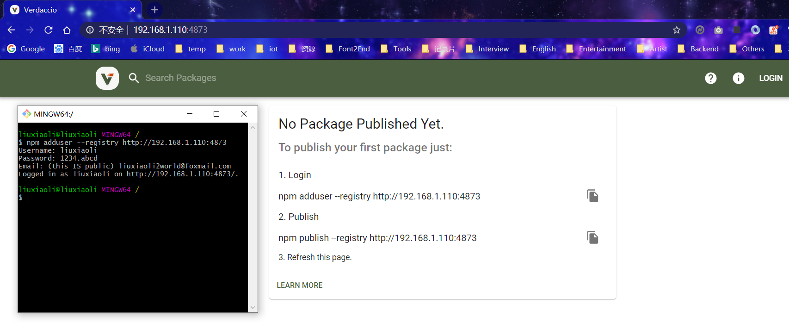

# 私有npm服务器

|           |      |      |      |
| --------- | ---- | ---- | ---- |
| npm--site |      |      |      |
| git+ssh   |      |      |      |
| cnpm      |      |      |      |
| verdaccio |      |      |      |


## npm--site

## git+ssh

## cnpm

## verdaccio

docker安装

```shell
# 拉取镜像
docker pull verdaccio/verdaccio
# 运行容器（--rm表示临时，退出时会删除容器）
docker run -it --rm --name verdaccio -p 4873:4873 verdaccio/verdaccio
```


```shell
npm adduser --registry http://192.168.1.110:4873
username: liuxiaoli
password: 1234.abcd
```

如下图所示：



## Nexus 

