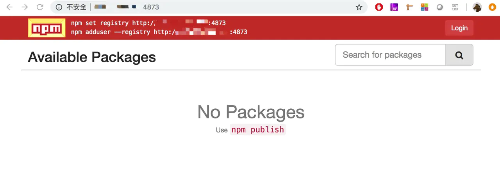
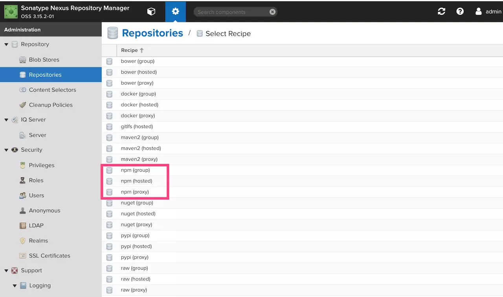

# 私有npm服务器

## 为何需要搭建私有npm仓库?

npm——我们大家都知道是NodeJS的包管理工具，用于Node插件的管理包括安装、卸载、管理依赖等。基于npm命令行我们可以快速的安装项目中所依赖的代码模块，甚至可以自己发布一些自己写的插件等。使得我们的项目开发效率得到大大的提升。

那么基于npm我们可以做哪些事情呢？简单来说就是：

- 一行命令，(批量）安装别人写好的模块

- 一行命令，卸载安装好的模块

- 一行命令，更新到最新（或指定版本）的模块

  

## npm及私有npm的工作原理？

在具体了解搭建过程之前，我们先简单了解下npm以及私有npm基本的工作原理。

我们使用npm安装、共享和分发代码，npm帮助我们管理项目中的依赖关系，那么它是如何做到的呢？

具体过程如下图：

图2 npm工作流程示意图

当我们使用npm install去安装一个模块时，会先检查node_modules目录中是否已经存在这个模块，如果没有便会向远程仓库查询。

npm提供了一个模块信息查询服务，通过访问

```text
registry.npmjs.org/packaename/version
```

就可以查到某个发布在npm模块上的具体信息以及下载地址，下载并解压到本地完成安装。

那如果我们搭建了私有的npm，上述这个过程将如何实现呢？

目前主流的实现方案大致是这样的：

图3 private npm工作流程示意图

用户install后向私有npm发起请求，服务器会先查询所请求的这个模块是否是我们自己的私有模块或已经缓存过的公共模块，如果是则直接返回给用户；如果请求的是一个还没有被缓存的公共模块，那么则会向上游源请求模块并进行缓存后返回给用户。

上游的源可以是npm仓库，也可以是淘宝镜像。

## 技术现状

业界主流的私有npm仓库搭建的主流方案有如下几种：

1. 付费购买
2. 使用 git+ssh 这种方式直接引用到 GitHub 项目地址
3. 使用[cnpmjs.org](https://link.zhihu.com/?target=https%3A//github.com/cnpm/cnpmjs.org)
4. 使用[Sinopia](https://link.zhihu.com/?target=https%3A//github.com/rlidwka/sinopia)
5. 使用Nexus 

第一种，一是考虑到公司可能不会提供经费，二npm在国内访问很慢，就是花钱也买不到好的体验。

第二种，不能更新即 *npm update，*不能使用 [semver](https://link.zhihu.com/?target=https%3A//www.npmjs.com/package/semver)（语义化版本规范）。

那么较好的选择就只剩下第三种和第四种。

下面将分别基于后三种方案来搭建私有npm仓库并进行总结。

## cnpm

[参考文章](https://zhuanlan.zhihu.com/p/35773211)

## sinopia/verdaccio

>  sinopia 在15年的时候就停止更新了，继而由 [verdaccio](https://github.com/verdaccio/verdaccio) 提供更新升级，两者用法基本上都是一致的。对于企业级的应用来说，技术选型时请慎重选择sinopia，建议选择verdaccio。

###  1. docker中安装

#### 1. 拉取docker镜像，运行docker容器

```shell
# 拉取镜像
docker pull verdaccio/verdaccio
# 运行容器（--rm表示临时，退出时会删除容器，-u root表示以root用户登录，否则无法修改config.yaml）
docker run -d --rm -u root --name verdaccio -p 4873:4873 verdaccio/verdaccio
# 运行容器（退出时不会删除容器）
docker run -d -u root --name verdaccio -p 4873:4873 verdaccio/verdaccio
```

#### 2. 新增用户（注意：新增用户需在本地进行，否则无权限提交！）

```shell
npm adduser --registry http://192.168.1.110:4873
username: liuxiaoli
password: 1234.abcd
```

如下图所示：


#### 3. 问题及解决方案

```shell
docker exec -it verdaccio sh
vi /verdaccio/conf/config.yaml
```

修改配置如下：

```ini
# error 413 Payload Too Large - PUT http://192.168.1.110:4873/clc.datacenter - request entity too large
max_body_size: 3000mb

# error 503 Service Unavailable - PUT http://192.168.1.110:4873/clc.datacenter - one of the uplinks is down, refuse to publish
publish:
    allow_offline: true
```

#### 4. 自动化打包并上传到本地npm服务器上，命令如下图所示：


上传完毕后结果如下图所示：


#### 5. 拉取报错


错误原因是依赖了华远的基础包，解决方案如下图，打开配置文件，修改uplinks为华远服务器：


重新下载成功！


#### 6.  修改npm registry为109服务器上，发现无法上传到109服务器，每次都上传到110服务器上，修改package.json配置：


再执行打包命令，成功，如下图：


### 2. 直接安装

#### 1. 服务器上安装node

Node 官网已经把 linux 下载版本更改为已编译好的版本了，我们可以直接下载解压后使用，[下载链接](https://nodejs.org/dist/)

我们选择node-v11.9.0-linux-x64.tar.gz这个版本：

```
$ wget https://nodejs.org/dist/v11.9.0/node-v11.9.0-linux-x64.tar.gz   #下载
$ tar xf node-v11.9.0-linux-x64.tar.gz       #解压
$ cd node-v11.9.0-linux-x64/                 #进入解压目录
$ ./bin/node -v                              #执行node命令 查看版本
v11.9.0
复制代码
```

使用ln命令设置软链接到/usr/local/bin目录，/usr/local/bin是给用户放置自己的可执行程序的地方：

```
ln -s /usr/local/node-v11.9.0-linux-x64/bin/npm   /usr/local/bin/ 
ln -s /usr/local/node-v11.9.0-linux-x64/bin/node   /usr/local/bin/
复制代码
```

#### 2. 服务器上安装Sinopia

使用默认npmjs.org registry，在服务器上安装sinopia：

```
$ npm install -g sinopia
$ sinopia                    
-bash: sinopia: command not found     #测试sinopia命令，此时会报找不到命令
复制代码
```

找不到命令，原因在于环境变量没设置，修改/etc/profile文件，在末尾添加以下内容：

```
export NODE_HOME=/usr/local/node-v11.9.0-linux-x64  #Node所在路径
export PATH=$NODE_HOME/bin:$PATH
复制代码
```

执行命令 source /etc/profile使生效，再次运行sinopia：

```
$ Sinopia doesn't need superuser privileges. Don't run it under root.
 warn  --- config file  - /root/.config/sinopia/config.yaml
 warn  --- http address - http://localhost:4873/
复制代码
```

修改iptables设置，开放4873端口：

```shell
# 允许4873端口
iptables -I INPUT 4 -p tcp -m state --state NEW -m tcp --dport 4873  -j ACCEPT    
# 保存iptables规则
service iptables save
```

**【坑1】访问虚拟机的npm仓库地址被拒绝**

除了开放iptables的4873端口外，还需要在sinopia的配置文件末尾加上：

```
listen: 0.0.0.0:4873
复制代码
```

重新启动

```
$ Sinopia doesn't need superuser privileges. Don't run it under root.
 warn  --- config file  - /root/.config/sinopia/config.yaml
 warn  --- http address - http://0.0.0.0:4873/
复制代码
```

这样我们就能通过自己虚拟机的ip:4873访问了



配置文件在/root/.config/sinopia/config.yaml，相关配置字段意义在文件中都有注释

#### 3. 使用守护进程启动（pm2）

​	安装：`npm install -g pm2` 启动：`pm2 start sinopia`

#### 4. 用户管理

配置文件中关于鉴权的默认配置为：

```
auth:
  htpasswd:
    file: ./htpasswd   //保存用户的账号密码等信息
    # Maximum amount of users allowed to register, defaults to "+inf".
    # You can set this to -1 to disable registration.
    max_users: 1000  //默认为1000，改为-1后，禁止注册
复制代码
```

添加用户的方法：在客户端终端运行 `npm adduser --registry http://xxxxx:4873/` ，设置相应的用户名、密码、邮箱后即可登录、发布包。

如果将配置项max_users设为-1，表示禁用 npm adduser 命令来创建用户，需手动在htpasswd文件中添加用户信息来初始化用户。

## Nexus 

[官方文档](https://help.sonatype.com/repomanager3)

### 搭建过程[参考文章](https://juejin.im/post/5c89184f5188257ded10e165#heading-3)

#### 1. 下载解压

官方下载链接]([help.sonatype.com/repomanager…](https://help.sonatype.com/repomanager3/download))，执行：

```
$ wget https://download.sonatype.com/nexus/3/latest-unix.tar.gz #下载
$ sudo mv latest-unix.tar.gz /opt/nexus3.tar.gz #移动到 /opt 目录
$ sudo tar -xzvf nexus3.tar.gz #解压
复制代码
```

> 注意运行Nexus需要Java 8 运行时环境(JRE)，请自行安装。

#### 2. 创建运行用户

单独创建一个 nexus 用户用来运行

```
# 创建用户、指定用户目录、授权
$ sudo useradd -d /home/nexus -m nexus
$ sudo chown -R nexus:nexus /home/nexus
$ sudo chown -R nexus:nexus /opt/nexus-3.15.2-01
$ sudo chown -R nexus:nexus /opt/sonatype-work/
复制代码
```

修改运行用户配置项：修改 /opt/nexus-3.15.2-01/bin 目录下的配置文件nexus.rc为 `run_as_user="nexus"`

#### 3. 运行

修改端口指8073并开放iptables防火墙，对/opt/sonatype-work/nexus3/etc/nexus.properties文件进行修改:

```
# Jetty section                                                     
application-port=8073
application-host=0.0.0.0                                                                 # nexus-args=${jetty.etc}/jetty.xml,${jetty.etc}/jetty-http.xml,${jetty.etc}/jetty-requestlog.xml                                               
# nexus-context-path=/                                                                   # Nexus section                                                                         # nexus-edition=nexus-pro-edition                                                       # nexus-features=\                                                                       #  nexus-pro-feature  
复制代码
```

启动服务，以下为nexus服务命令:

```
# 启动 nexus 服务
$ sudo service nexus start
# 重启 nexus 服务
$ sudo service nexus restart
# 停止 nexus 服务
$ sudo service nexus stop
# 查看 nexus 服务状态
$ sudo service nexus status 
复制代码
```

查看日志检查服务状态：

```
$ tail -f /opt/sonatype-work/nexus3/log/nexus.log
复制代码
```

至此，nexus 服务已搭建完毕！可使用默认账号admin/admin123 登录ip:8073后对npm仓库进行管理


#### 4. 仓库管理

创建仓库，npm 仓库有三种，这三种我们都需要创建



1. npm(proxy) - 代理npm仓库

   将公共 npm 服务器的资源代理缓存，减少重复下载，加快开发人员和CI服务器的下载速度。

   创建时需填写Name(`npm-external`)和Remote Storage(公有库地址，填写官方或淘宝镜像，`https://registry.npmjs.org/`)。

   该仓库地址为：`http://ip:8073/repository/npm-external/`

2. npm(hosted) - 私有npm仓库

   用于 上传自己的npm包 以及第三方npm包。

   创建时只需填写Name(`npm-internal`)。

   该仓库地址为：`http://ip:8073/repository/npm-internal/`

   > 请注意：发布包时请将registry设为该地址。

3. npm(group) - npm仓库组

   用于将多个内部或外部 npm 仓库统一为一个 npm仓库。可以新建一个npm仓库组将 上面两个刚刚创建的两个 npm 仓库都添加进去。这样可以通过这个 npm仓库组，既可以访问 公有npm仓库 又可以访问自己的 私有npm仓库。

   创建时需填写Name(`npm-all`)，然后选择需要添加到组里的 其他 npm 仓库(`npm-external`和`npm-internal`)。

   该仓库地址为：`http://ip:8073/repository/npm-all/`

   > 请注意：安装包以及卸载包时请将registry设为该地址。

#### 5. 用户管理

将包发布到nexus npm仓库需要设置一下 Nexus Repository Manager 的权限。否则无法登陆到我们的私服。在Security->Realms栏目里，将`npm Bearer Token Realm` 选入Active。


之后我们需要在Security->Users栏目里添加用户，只有这样添加的用户才可以发布包。经测试，在客户端使用 `npm adduser` 创建的用户没有发布权限。

##  客户端使用

### 使用 nrm 管理registry

```shell
$npm install -g nrm
 
$ nrm ls
* npm ---- https://registry.npmjs.org/
  cnpm --- http://r.cnpmjs.org/
  taobao - https://registry.npm.taobao.org/
  nj ----- https://registry.nodejitsu.com/
  rednpm - http://registry.mirror.cqupt.edu.cn/
  npmMirror  https://skimdb.npmjs.com/registry/
  edunpm - http://registry.enpmjs.org/
  
$ nrm add ynpm http://XXXXXX:4873 # 添加私服的npm镜像地址
$ nrm use ynpm # 使用私服的镜像地址
```

### 安装包

```shell
npm install lodash # sinopia发现本地没有 lodash包,就会从官方镜像下载
npm --loglevel info install lodash  # 设置loglevel 可查看下载包时的详细请求信息
复制代码
[storage]$ ls      
#下载过之后，私服的storage目录下回缓存安装包
[storage]$ ls                                                                                   
lodash
复制代码
rm -rf node-modules # 删除目录
npm insatll lodash # 第二次安装就会从缓存下载了,速度很快
```

### 发布包与撤销发布包

在项目根目录下运行`$ npm publish`发布新包。

运行`$ npm unpublish 包名 --force`撤销发布包。

```
$ npm publish
+ @shawn280/ly-cli@1.0.0
```

查看发布的包，已成功发布：


### 作用域scope管理发布包

经常有看到`@xxx/yyy`类型的开源npm包，原因是包名称难免会有重名，如果已经有人在 `npm` 上注册该包名，再次 `npm publish` 同名包时会告知发布失败，这时可以通过 `scope` 作用域来解决

- 定义作用域包

  修改package.json中包名称：

  ```json
  {
       "name": "@username/project-name"
  }
  ```
  
> 需要注意的是，如果是发布到官方registry，scope一定要是自己注册的用户名，而如果是发布到自己的npm私服，scope可以不是用户名

- 发布作用域包

  作用域模块默认发布是私有的

  发布到官方registry时，直接`npm publish`会报错，原因是只有付费用户才能发布私有 scope 包，免费用户只能发布公用包，因此需要添加 `access=public` 参数；

  发布到自己的npm私服时，不加`access=public`参数也可以发布

  ```
  npm publish --access=public
  ```
  
- 使用作用域包

  ```
  npm install @username/project-name
  var projectName = require('@username/project-name')
  ```

## 总结

- 以上的情况并没有考虑在遇到一些黑客攻击的情况下，所以为了尽量保证代码的安全，可以在前端加一层 Nginx 然后配置 SSH 公钥来作为双层验证。
- nexus和sinopia两种解决方案的对比：
  1. 都缓存了从proxy仓库下载过的包，没有同步整个proxy仓库的包。
  2. 存储方式：nexus使用blob store，sinopia直接保存包文件到storage目录。
  3. nexus管理界面可以清缓存；sinopia貌似没有命令和工具，但是可以删除通过删除storage目录下包目录的方式清除缓存。
  4. 使用nexus时，`发布包`和`安装、卸载包`需要设置不同的registry，而Sinopia一直用同一个就可以。
  5. nexus管理页面上展示了更多的包信息，相比而言sinopia也就是nodejs风格的包主页上信息较少。
  6. sinopia更适合前端工程，优点是配置简单，对环境依赖少（仅node就够了），并且支持在windows系统下运行；nexus支持仓库种类最多，是用户群体最大的一个仓库平台，maven、docker、npm、gradle均支持，java需要maven仓库、android需要gradle仓库、运维需要docker仓库，前端需要npm仓库，如果公司已有nexus平台管理这些仓库，接入新的仓库会较方便。
  7. sinopia 的权限管理比较弱，对用户权限，发布权限，下载权限控制不是很得心应手；[缓存优化不足，经常会在安装共有包的时候处于挂起状态](https://segmentfault.com/a/1190000015297864)。

- Sinopia和cnpm两种方案对比：

  1.  Sinopia比较偏向于一个零配置、轻量型的私有npm模块管理工具，不需要额外的数据库配置，它内部自带小型数据库，支持私有模块管理的同时也支持缓存使用过的公共模块，发布及缓存的模块以静态资源形式本地存储。支持静态配置型用户管理机制，以及分层模块权限设置。
  2.  cnpm可以实现公共模块镜像更新以及私有模块管理，支持拓展多种存储形式，相对的数据库的配置较多，部署过程略复杂。是淘宝及多家大型公司搭建内部私有npm仓库选择的方案。
  3. cnpm的方案在部署过程以及整体设计上要比Sinopia复杂的多，维护成本也比较高；但相对的也提供更高的扩展性，可以支持多种业务场景；

俗话说：脱离业务场景谈解决方案，都是耍流氓。
