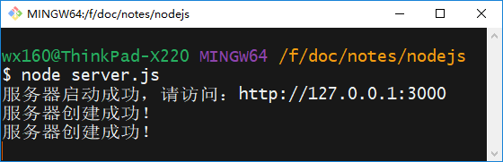

#  创建服务

##  简单的服务

server.js文件：

```javascript
var http = require('http');
var server = http.createServer();
var port = 3000;
server.on('request', function(req, res) {
   console.log('服务器创建成功！');
    // 只能发送string或buffer类型的数据，默认是buffer类型，需要调用toString方法转换成字符串，json类型的数据，需要转换成json字符串
    var jsonObj = {"name": "liuxiaoli", "gender": "female"};    
    res.end(JSON.stringfy(jsonObj));
});

// 添加监听，启动服务
server.listen(port, function() {
    console.log('服务器启动成功，请访问：http://127.0.0.1:' + port);
});
```

运行命令行：




