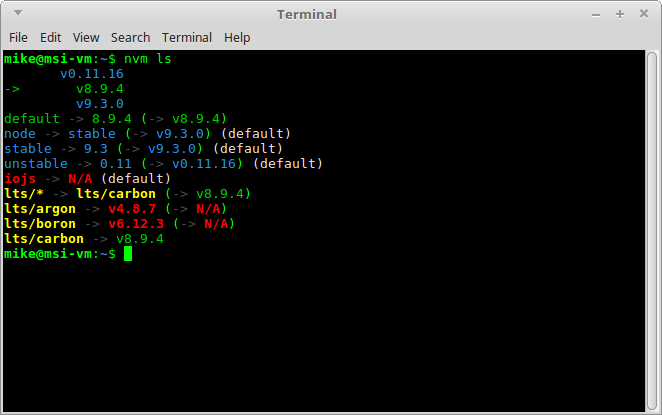
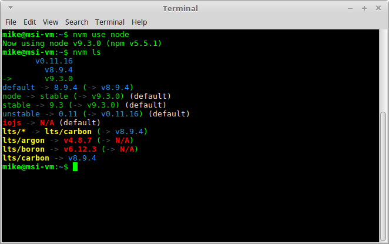

# Installing Multiple Versions of Node.js Using nvm


**When developing Node.js applications, you might face situations where you need to install multiple versions of Node. This can happen when you have multiple projects and they have different requirements, or you have a deployable application which must be compatible with different Node versions. Without a good tool, this would mean a lot of work and effort to install the different versions manually, and basing a project on a specific version. Fortunately, there’s a better way!**

## Introducing nvm

[nvm](https://github.com/creationix/nvm) stands for Node Version Manager. As the name suggests, it helps you manage and switch between different Node versions with ease. It provides a command line interface where you can install different versions with a single command, set a default, switch between them and much more.

## OS Support

nvm supports both Linux and macOS, but that’s not to say that Windows users have to miss out. There’s a second project named [nvm-windows](https://github.com/coreybutler/nvm-windows) which offers Windows users the possibility of easily managing Node environments. Despite the name, nvm-windows is not a clone of nvm, nor is it affiliated with it. However, the basic commands listed below (for installing, listing and switching between versions) should work for both nvm and nvm-windows.

## Installation

Let’s first cover installation for Windows, macOS and Linux.

### Windows

First, make sure you uninstall any Node.js version you might have on your system, as they can collide with the installation. After this, download the [latest stable installer](https://github.com/coreybutler/nvm-windows/releases). Run the executable installer, follow the steps provided and you’re good to go!

### macOS/Linux

Removing previous Node installations is optional, although it’s advised you do so. There are plenty of good online resources for how you might do this ([macOS](http://stackoverflow.com/q/11177954/1136887), [Linux](http://stackoverflow.com/q/5650169/1136887)). It’s also good if you [remove any npm installation](https://docs.npmjs.com/misc/removing-npm) you might have, since it might collide with nvm’s installation. You’ll also need to have a C++ compiler installed on your system. For macOS, you can install the Xcode command line tools. You can do this by running the following command:

```bash
xcode-select --install
```

On Linux, you can install the build-essential package by running the following (assumes [apt](https://wiki.debian.org/Apt)):

```bash
sudo apt-get update
sudo apt-get install build-essential
```

Having the required C++ compiler, you can then install nvm using cURL or Wget. On your terminal, run the following:

With [cURL](https://curl.haxx.se/):

```bash
curl -o- https://raw.githubusercontent.com/creationix/nvm/v0.33.8/install.sh | bash
```

Or with [Wget](https://www.gnu.org/software/wget/):

```bash
wget -qO- https://raw.githubusercontent.com/creationix/nvm/v0.33.8/install.sh | bash
```

Note that the version number (v0.33.8) will change as the project develops, so it’s worth checking the [relevant section of project’s home page](https://github.com/creationix/nvm#install-script) to find the most recent version.

This will clone the nvm repository to `~/.nvm` and will make the required changes to your bash profile, so that `nvm` is available from anywhere in your terminal.

That’s it, nvm is installed and ready to be used.

## Using nvm

If installed correctly, the `nvm` command is available anywhere in you terminal. Let’s see how to use it to manage Node.js versions.


### Install Multiple Versions of Node.js

One of the most important parts of nvm is, of course, installing different versions of Node.js. For this, nvm provides the `nvm install` command. You can install specific versions by running this command followed by the version you want. For example:

```bash
nvm install 8.9.4
```

By running the above in a terminal, nvm will install Node.js version 8.9.4. nvm follows [SemVer](http://semver.org/), so if you want to install, for example, the latest 8.9 patch, you can do it by running:

```bash
nvm install 8.9
```

nvm, will then install Node.js version 8.9.X, where X is the highest available version. At the time of writing, this is 4, so you’ll have the 8.9.4 version installed on your system. You can see the full list of available versions by running:

```bash
nvm ls-remote
```

For nvm-windows, this is:

```undefined
nvm ls available
```

### npm

When installing a Node.js instance, nvm will also install a compatible [npm](http://www.sitepoint.com/beginners-guide-node-package-manager/) version. Each Node version might bring a different npm version, and you can run `npm -v` to check which one you’re currently using. Globally installed npm packages are not shared among different Node.js versions, as this could cause incompatibilities. Rather, they’re installed alongside the current Node version in `~/.nvm/versions/node/<version>/lib/node_modules`. This has the added advantage that users won’t require sudo privileges to install global packages.

Fortunately, when installing a new Node.js version, you can reinstall the npm global packages from a specific version. For example:

```bash
nvm install v9.0.0 --reinstall-packages-from=8.9
```

By running the above, nvm will install Node.js version 9.0.0, the corresponding npm version, and reinstall the npm packages you had installed on the 8.9 version.

To help even further, nvm has some aliases that you can use to target versions without writing a specific version:

- `node`: this installs the latest Node.js version
- `unstable`: this installs Node.js 0.11 version, which is the last unstable version.

So, to install the latest Node.js version, you can just run:

```bash
nvm install latest
```

You can also uninstall any instance you no longer think is useful, by running:

```bash
nvm uninstall 0.11
```

### Switching between Versions

So far, we’ve seen how to install different Node versions. Let’s now go through how to switch between them. Let me first note that when a new version is installed, it’s automatically put to use. So if you install latest Node.js version, and run `node -v` right after, you’ll see the latest version output.

To switch through installed versions, nvm provides the `nvm use` command. This works similar to the install command. So, you need to follow this by a version number or one of the aliases.

Following the install commands demonstrated above, you can:


- switch to Node.js version 8.9.4:

  ~~~undefined
  ```bash
  nvm use 8.9.4
  ```
  ~~~

- switch to Node.js version 9.3.0:

  ~~~undefined
  ```bash
  nvm use 9.3
  ```
  ~~~

- switch to latest Node.js version:

  ~~~undefined
  ```bash
  nvm use node
  ```
  ~~~

- switch to latest LTS Node.js version:

  ~~~undefined
  ```bash
  nvm use node --lts
  ```
  ~~~

When switching to a different version, nvm will make the `node` instance in your terminal symlink to the proper Node.js instance.

You can also create custom aliases beyond the ones that come with nvm. For example, by running:

```bash
nvm alias awesome-version 8.9.4
```

You’re setting an alias with the name “awesome-version” for Node.js version 8.9.4. So, if you now run:

```bash
nvm use awesome-version
```

nvm will switch `node` to version 8.9.4. You can delete an alias by running:

```bash
nvm unalias awesome-version
```

You can also set a default instance to be used in any shell, by targeting a version to the “default” alias, like so:

```bash
nvm alias default node
```

**Note on io.js**

As from Node.js v4, all features of [io.js](https://iojs.org/en/) were merged into the Node.js project. `io.js` is no longer under development.

### Listing installed instances

At anytime you can check which versions you have installed by running:

```bash
nvm ls
```

This will display something resembling the following:




The entry in green, with an arrow on the left, is the current version in use. Below the green and blue list, there’s a list of available aliases. If you now execute:

```bash
nvm use node
nvm ls
```

It will display:



You can also check what is the current version in use with the command:

```bash
nvm current
```

### Specify a Node Version on a Per-Project Basis

Version managers such as [rbenv](https://github.com/rbenv/rbenv) allow you to specify a Ruby version on a per-project basis (by writing that version to a `.ruby-version` file in your current directory). This is kind of possible with nvm in that, if you create a `.nvmrc` file inside a project and specify a version number, you can cd into the project directory and type `nvm use`. nvm will then read the contents of the `.nvmrc` file and use whatever version of Node you specify.

If it’s really important to you that this happens automatically, there’s a project ([avn](https://github.com/wbyoung/avn)) which integrates with nvm, and is designed to address this need.

### Other nvm Commands

There are other commands nvm provides, which are more of advanced or not common usage:

- running a command directly for an installed version without switching the `node` variable:

  ~~~undefined
  ```bash
  nvm run 8.9.4 --version
  ```
  ~~~

- running a command on a sub-shell, targeting a specific version:

  ~~~undefined
  ```bash
  nvm exec 8.9.4 node --version
  ```
  ~~~

- getting the path to the Node.js executable of a specific installed version:

  ~~~undefined
  ```bash
  nvm which 8.9.4
  ```
  ~~~

## Conclusion

nvm is a great tool for any Node.js developer. It enables a concern-free installation and switching between different versions, saving time for what really matters.

A thank you note to [Tim Caswell](https://github.com/creationix) the creator of nvm, and [Corey Butler](https://github.com/coreybutler) for the nvm for Windows support, and of course to the contributors of these great projects. Your work is greatly appreciated by the Node.js community.

What about you? Do you use nvm? How has your experience been with it? Would love to hear from you in the comments below.

*This article was peer reviewed by Tim Severien. Thanks to all of SitePoint’s peer reviewers for making SitePoint content the best it can be!*