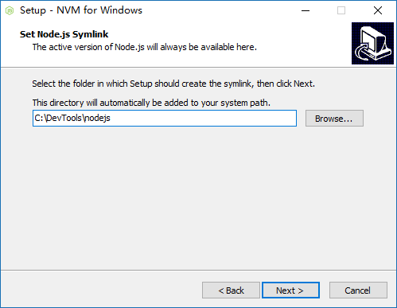

# windows下npm版本管理nvm

### 下载安装与使用

#### [Github： Download nvm-windows --- nvm-setup.zip](https://github.com/coreybutler/nvm-windows/releases)



程序安装过程中，在 `Set Node.js Symlink` 这一步目录设置，
是待会 `nvm use` 存放你的 **nodejs** 程序的目录 [`C:\\DevTools\\nodejs`]。

```bash
nvm v # 查看版本 => 1.1.1 
nvm install latest # 下载最新的 node 版本 v7.2.0

nvm install 4.4.4 # 安装不同版本
nvm install 6.2.0 32 # 默认是64位，32位需指定
nvm uninstall 6.2.0 # 卸载对应的版本
```

下载完成后，会在 `\nvm` 文件夹下多个 `v7.2.0` 文件夹。

```shell
nvm use 7.2.0 # 引入使用
nvm list # 查看已安装的 node 版本

  * 7.2.0 (Currently using 64-bit executable)
    6.2.0
    4.4.4
```

更多命令使用键入 `nvm` 查看。

这时就会在 `C:\\DevTools\\nodejs` 的目录出现个 [nodejs](https://nodejs.org/en/) 的快捷方式。

### 配置 npm 全局安装路径

执行下面的命令：

```
npm config set prefix "E:\nodejs\npm-global"
```

`C:\\Users\\你的用户名\\` 会生成个 `.npmrc` 文件，内容如下：

```
prefix=E:\nodejs\npm-global
```

去装些全局的东西 `npm install vue -g`.
全局的所有包都在这：`E:\nodejs\npm-global\node_modules`

`设置——系统——关于——系统信息——高级程序设置——环境变量——xxx用户的变量`
修改环境变量，将 `C:\\Users\\你的用户名\\AppData\\Roaming\\npm` 修改为 `PATH E:\\nodejs\\npm-global`.

### 安装 [cnpm](https://npm.taobao.org/)

```
npm install -g cnpm --registry=https://registry.npm.taobao.org
npm install -g cnpm --registry=http://r.cnpmjs.org
```

### 解决 nvm 无法切换源

> 由于最近重装了 node & nvm, 使用时 `nvm install` 正常，但是切换源无法使用。

```
nvm use 8.0.0
Now using node v8.0.0 (64-bit) # 这个提示正常来讲是切换成功的

node -v
v7.6.4 # 还是原来版本
```

**卸载原来已安装的 node, 与全局安装的包**

### 解决 nvm 下载慢的问题

> 在程序安装目录下找到 `settings.txt`，添加下面两行。

```
root: C:\Program Files\nvm
path: C:\Program Files\nodejs
+ node_mirror: https://npm.taobao.org/mirrors/node/
+ npm_mirror: https://npm.taobao.org/mirrors/npm/
```