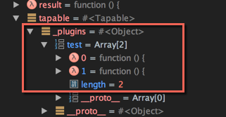
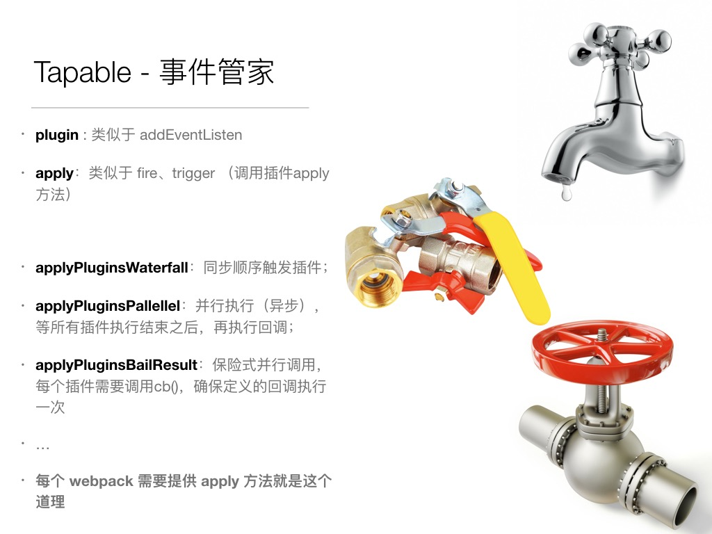
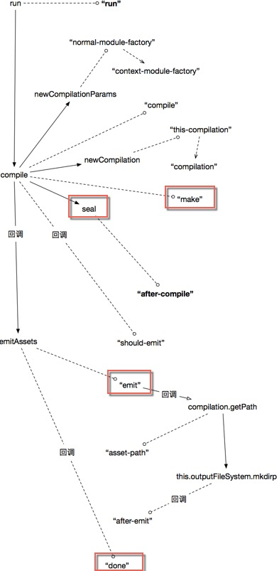

# [Webpack 源码（一）—— Tapable 和 事件流](https://segmentfault.com/a/1190000008060440)


## 1、Tapable

Tap 的英文单词解释，除了最常用的 **点击** 手势之外，还有一个意思是 **水龙头** —— 在 webpack 中指的是后一种；

Webpack 可以认为是一种基于事件流的编程范例，内部的工作流程都是基于 **插件** 机制串接起来；

而将这些插件粘合起来的就是webpack自己写的基础类 [Tapable](https://github.com/webpack/tapable/blob/master/lib/Tapable.js) 是，`plugin`方法就是该类暴露出来的；

> 后面我们将看到核心的对象 Compiler、Compilation 等都是继承于该对象

基于该类规范而其的 Webpack 体系保证了插件的有序性，使得整个系统非常有弹性，扩展性很好；然而有一个致命的缺点就是调试、看源码真是很痛苦，各种跳来跳去；（基于事件流的写法，和程序语言中的 **goto** 语句很类似）

把这个仓库下载，使用 Webstorm 进行调试，test 目录是很好的教程入口；

Tapable.plugin()：相当于把对象归类到名为 name 的对象下，以array的形式；所有的插件都存在私有变量 **_plugin** 变量中；



接下来我们简单节选几个函数分析一下：

### 1.1、apply 方法

该方法最普通也是最常用的，看一下它的定义：

```js
Tapable.prototype.apply = function apply() {
    for(var i = 0; i < arguments.length; i++) {
        arguments[i].apply(this);
    }
};
```

毫无悬念，就是 **挨个顺序** 执行传入到该函数方法中对象的 `apply` 方法；通常传入该函数的对象也是 **Tapable 插件** 对象，因此必然也存在 `apply` 方法；（Webpack 的插件就是Tapable对象，因此必须要提供 `apply` 方法 ）

只是更改上下文为当前 `this`

因此当前这里最大的作用就是传入当前 **Tapable** 的上下文

### 1.2、 applyPluginsAsync(name,...other,callback)

```js
// 模拟两个插件
var _plugins = {
    "emit":[
        function(a,b,cb){
            setTimeout(()=>{
              console.log('1',a,b);
              cb();
            },1000);
        },
        function(a,b,cb){
            setTimeout(()=>{
                console.log('2',a,b);
                cb();
            },500)
        }
    ]
}

applyPluginsAsync("emit",'aaaa','bbbbb',function(){console.log('end')});

// 输出结果：

// 1 aaaa bbbbb
// 2 aaaa bbbbb
//  end
```

我们看到，虽然第一个插件是延后 1000ms 执行，第二个则是延后 500ms，但在真正执行的时候，是严格按照顺序执行的；每个插件需要在最后显式调用`cb()`通知下一个插件的运行；

这里需要注意每个插件的形参的个数都要一致，且最后一个必须是cb()方法，用于唤起下一个插件的运行；cb的第一个参数是err，如果该参数不为空，就直接调用最后callback，中断后续插件的运行；

### 1.3、 applyPluginsParallel(name,...other,callback)

> 大部分代码和 `applyPluginsAsync` 有点儿类似

这个 `applyPluginsParallel` 主要功能和 最简单的 `applyPlugins` 方法比较相似，**无论如何都会让所有注册的插件运行一遍**；

只是相比 `applyPlugins` 多了一个额外的功能，它最后 **提供一个 callback 函数**，这个 callback 的函数比较倔强，如果所有的插件x都正常执行，且最后都cb()，则会在最后执行callback里的逻辑；不过，一旦其中某个插件运行出错，就会调用这个callback(err)，之后就算插件有错误也不会再调用该callback函数；

```js
var _plugins = {
"emit":[
    function(a,b,cb){
        setTimeout(()=>{
          console.log('1',a,b);
          cb(null,'e222','33333');
        },1000);
    },
    function(a,b,cb){
        setTimeout(()=>{
            console.log('2',a,b);
            cb(null,'err');
        },500)
    }
]
}

applyPluginsParallel("emit",'aaaa','bbbbb',function(a,b){console.log('end',a,b)});

// 输出结果：

// 2 aaaa bbbbb
// 1 aaaa bbbbb
//  end undefined undefined
```

上面的两个插件都是调用了 cb，且第一个参数是 null（表示没有错误），所以最后能输出 callback 函数中的 console 内容；

如果注释两个插件中任何一个 cb() 调用，你会发现最后的 callback **没有执行**；

如果让 **第二个** cb()的第一个值不是 null，比如 cb('err')，则 callback 之后输出这个错误，之后再也不会调用此 callback：

```js
var _plugins = {
"emit":[
    function(a,b,cb){
        setTimeout(()=>{
          console.log('1',a,b);
          cb('e222','33333');
        },1000);
    },
    function(a,b,cb){
        setTimeout(()=>{
            console.log('2',a,b);
            cb('err');
        },500)
    }
]
}

// 输出结果：

// 2 aaaa bbbbb
// end err undefined
// 1 aaaa bbbbb
```

### 1.4、 applyPluginsWaterfall(name, init, callback)

顾名思义，这个方法相当于是 **瀑布式** 调用，给第一个插件传入初始对象 `init`，然后经过第一个插件调用之后会获得一个结果对象，该结果对象会传给下一个插件 **作为初始值**，直到最后调用完毕，最后一个插件的直接结果传给 callback 作为初始值；

### 1.5、 applyPluginsParallelBailResult(name,...other,callback)

这个方法应该是所有方法中最难理解的；

首先它的行为和 `applyPluginsParallel` 非常相似，首先会 **无论如何都会让所有注册的插件运行一遍（根据注册的顺序）**；

为了让 callback 执行，其前提条件是每个插件都需要调用 cb()；

但其中的 callback 只会执行一次（当传给cb的值不是undefined/null 的时候），这一次执行顺序是插件定义顺序有关，**而跟每个插件中的 cb() 执行时间无关的**；

```js
var _plugins = {
"emit":[
    function(a,b,cb){
        setTimeout(()=>{
          console.log('1',a,b);
          cb();
        },1000);
    },
    function(a,b,cb){
        setTimeout(()=>{
            console.log('2',a,b);
            cb();
        },500)
    },
    function(a,b,cb){
        setTimeout(()=>{
            console.log('3',a,b);
            cb();
        },1500)
    }
]
}

applyPluginsParallelBailResult("emit",'aaaa','bbbbb',function(a,b){console.log('end',a,b)});

// 运行结果

// 2 aaaa bbbbb
// 1 aaaa bbbbb
// 3 aaaa bbbbb
// end undefined undefined
```

这是最普通的运行情况，我们稍微调整一下（注意三个插件运行的顺序2-1-3），分别给cb传入有效的值：

```js
var _plugins = {
"emit":[
    function(a,b,cb){
        setTimeout(()=>{
          console.log('1',a,b);
          cb('1');
        },1000);
    },
    function(a,b,cb){
        setTimeout(()=>{
            console.log('2',a,b);
            cb('2');
        },500)
    },
    function(a,b,cb){
        setTimeout(()=>{
            console.log('3',a,b);
            cb('3');
        },1500)
    }
]
}
applyPluginsParallelBailResult("emit",'aaaa','bbbbb',function(a,b){console.log('end',a,b)});
// 运行结果

// 2 aaaa bbbbb
// 1 aaaa bbbbb
// end 1 undefined
// 3 aaaa bbbbb
```

可以发现第1个插件 `cb('1')` 执行了，后续的 `cb('2')` 和 `cb('3')` 都给忽略了；

这是因为插件注册顺序是 1-2-3，虽然运行的时候顺序是 2-1-3，但所运行的还是 1 对应的 cb；所以，就算1执行的速度最慢（比如把其setTimeout的值设置成 **2000**），运行的 cb 仍然是1对应的cb;

> 其中涉及的魔法是 闭包，传入的i就是和注册顺序绑定了
> 这样一说明，你会发现 applyPluginsParallel 的 cb 执行时机是和执行时间有关系的，你可以自己验证一下；

### 1.6、总结

总结一下，Tapable 就相当于是一个 **事件管家**，它所提供的 `plugin` 方法类似于 `addEventListen` 监听事件，`apply` 方法类似于事件触发函数 `trigger`；



## 2、Webpack 中的事件流

既然 Webpack 是基于 Tapable 搭建起来的，那么我们看一下 Webpack 构建一个模块的基本事件流是如何的；

我们在 Webpack 库中的 **Tapable.js** 中每个方法中新增 `console` 语句打出日志，就能找出所有关键的事件名字：


打印结果：（这里只列举了简单的事件流程，打包不同的入口文件会有所差异，但 **事件出现的先后顺序是固定的** ）

| 类型 | 名字                           | 事件名                          |
| :--- | :----------------------------- | :------------------------------ |
| [C]  | applyPluginsBailResult         | entry-option                    |
| [A]  | applyPlugins                   | after-plugins                   |
| [A]  | applyPlugins                   | after-resolvers                 |
| [A]  | applyPlugins                   | environment                     |
| [A]  | applyPlugins                   | after-environment               |
| [D]  | applyPluginsAsyncSeries        | run                             |
| [A]  | applyPlugins                   | normal-module-factory           |
| [A]  | applyPlugins                   | context-module-factory          |
| [A]  | applyPlugins                   | compile                         |
| [A]  | applyPlugins                   | this-compilation                |
| [A]  | applyPlugins                   | compilation                     |
| [F]  | applyPluginsParallel           | make                            |
| [E]  | applyPluginsAsyncWaterfall     | before-resolve                  |
| [B]  | applyPluginsWaterfall          | factory                         |
| [B]  | applyPluginsWaterfall          | resolver                        |
| [A]  | applyPlugins                   | resolve                         |
| [A]  | applyPlugins                   | resolve-step                    |
| [G]  | applyPluginsParallelBailResult | file                            |
| [G]  | applyPluginsParallelBailResult | directory                       |
| [A]  | applyPlugins                   | resolve-step                    |
| [G]  | applyPluginsParallelBailResult | result                          |
| [E]  | applyPluginsAsyncWaterfall     | after-resolve                   |
| [C]  | applyPluginsBailResult         | create-module                   |
| [B]  | applyPluginsWaterfall          | module                          |
| [A]  | applyPlugins                   | build-module                    |
| [A]  | applyPlugins                   | normal-module-loader            |
| [C]  | applyPluginsBailResult         | program                         |
| [C]  | applyPluginsBailResult         | statement                       |
| [C]  | applyPluginsBailResult         | evaluate CallExpression         |
| [C]  | applyPluginsBailResult         | var data                        |
| [C]  | applyPluginsBailResult         | evaluate Identifier             |
| [C]  | applyPluginsBailResult         | evaluate Identifier require     |
| [C]  | applyPluginsBailResult         | call require                    |
| [C]  | applyPluginsBailResult         | evaluate Literal                |
| [C]  | applyPluginsBailResult         | call require:amd:array          |
| [C]  | applyPluginsBailResult         | evaluate Literal                |
| [C]  | applyPluginsBailResult         | call require:commonjs:item      |
| [C]  | applyPluginsBailResult         | statement                       |
| [C]  | applyPluginsBailResult         | evaluate MemberExpression       |
| [C]  | applyPluginsBailResult         | evaluate Identifier console.log |
| [C]  | applyPluginsBailResult         | call console.log                |
| [C]  | applyPluginsBailResult         | expression console.log          |
| [C]  | applyPluginsBailResult         | expression console              |
| [A]  | applyPlugins                   | succeed-module                  |
| [E]  | applyPluginsAsyncWaterfall     | before-resolve                  |
| [B]  | applyPluginsWaterfall          | factory                         |
| [A]  | applyPlugins                   | build-module                    |
| [A]  | applyPlugins                   | succeed-module                  |
| [A]  | applyPlugins                   | seal                            |
| [A]  | applyPlugins                   | optimize                        |
| [A]  | applyPlugins                   | optimize-modules                |
| [A]  | applyPlugins                   | after-optimize-modules          |
| [A]  | applyPlugins                   | optimize-chunks                 |
| [A]  | applyPlugins                   | after-optimize-chunks           |
| [D]  | applyPluginsAsyncSeries        | optimize-tree                   |
| [A]  | applyPlugins                   | after-optimize-tree             |
| [C]  | applyPluginsBailResult         | should-record                   |
| [A]  | applyPlugins                   | revive-modules                  |
| [A]  | applyPlugins                   | optimize-module-order           |
| [A]  | applyPlugins                   | before-module-ids               |
| [A]  | applyPlugins                   | optimize-module-ids             |
| [A]  | applyPlugins                   | after-optimize-module-ids       |
| [A]  | applyPlugins                   | record-modules                  |
| [A]  | applyPlugins                   | revive-chunks                   |
| [A]  | applyPlugins                   | optimize-chunk-order            |
| [A]  | applyPlugins                   | before-chunk-ids                |
| [A]  | applyPlugins                   | optimize-chunk-ids              |
| [A]  | applyPlugins                   | after-optimize-chunk-ids        |
| [A]  | applyPlugins                   | record-chunks                   |
| [A]  | applyPlugins                   | before-hash                     |
| [A]  | applyPlugins                   | hash                            |
| [A]  | applyPlugins                   | hash                            |
| [A]  | applyPlugins                   | hash                            |
| [A]  | applyPlugins                   | hash                            |
| [A]  | applyPlugins                   | hash-for-chunk                  |
| [A]  | applyPlugins                   | chunk-hash                      |
| [A]  | applyPlugins                   | after-hash                      |
| [A]  | applyPlugins                   | before-chunk-assets             |
| [B]  | applyPluginsWaterfall          | global-hash-paths               |
| [C]  | applyPluginsBailResult         | global-hash                     |
| [B]  | applyPluginsWaterfall          | bootstrap                       |
| [B]  | applyPluginsWaterfall          | local-vars                      |
| [B]  | applyPluginsWaterfall          | require                         |
| [B]  | applyPluginsWaterfall          | module-obj                      |
| [B]  | applyPluginsWaterfall          | module-require                  |
| [B]  | applyPluginsWaterfall          | require-extensions              |
| [B]  | applyPluginsWaterfall          | asset-path                      |
| [B]  | applyPluginsWaterfall          | startup                         |
| [B]  | applyPluginsWaterfall          | module-require                  |
| [B]  | applyPluginsWaterfall          | render                          |
| [B]  | applyPluginsWaterfall          | module                          |
| [B]  | applyPluginsWaterfall          | render                          |
| [B]  | applyPluginsWaterfall          | package                         |
| [B]  | applyPluginsWaterfall          | module                          |
| [B]  | applyPluginsWaterfall          | render                          |
| [B]  | applyPluginsWaterfall          | package                         |
| [B]  | applyPluginsWaterfall          | modules                         |
| [B]  | applyPluginsWaterfall          | render-with-entry               |
| [B]  | applyPluginsWaterfall          | asset-path                      |
| [B]  | applyPluginsWaterfall          | asset-path                      |
| [A]  | applyPlugins                   | chunk-asset                     |
| [A]  | applyPlugins                   | additional-chunk-assets         |
| [A]  | applyPlugins                   | record                          |
| [D]  | applyPluginsAsyncSeries        | additional-assets               |
| [D]  | applyPluginsAsyncSeries        | optimize-chunk-assets           |
| [A]  | applyPlugins                   | after-optimize-chunk-assets     |
| [D]  | applyPluginsAsyncSeries        | optimize-assets                 |
| [A]  | applyPlugins                   | after-optimize-assets           |
| [D]  | applyPluginsAsyncSeries        | after-compile                   |
| [C]  | applyPluginsBailResult         | should-emit                     |
| [D]  | applyPluginsAsyncSeries        | emit                            |
| [B]  | applyPluginsWaterfall          | asset-path                      |
| [D]  | applyPluginsAsyncSeries        | after-emit                      |
| [A]  | applyPlugins                   | done                            |

内容较多，依据源码内容的编排，可以将上述进行分层；**大粒度**的事件流如下：



而其中 **make**、 **seal** 和 **emit** 阶段比较核心（包含了很多小粒度的事件），后续会继续展开讲解；

这里罗列一下关键的事件节点：

- `entry-option`：初始化options
- `run`：开始编译
- `make`：从entry开始递归的分析依赖，对每个依赖模块进行build
- `before-resolve - after-resolve`： 对其中一个模块位置进行解析
- `build-module `：开始构建 (build) 这个module,这里将使用文件对应的loader加载
- `normal-module-loader`：对用loader加载完成的module(是一段js代码)进行编译,用 [acorn](https://github.com/ternjs/acorn) 编译,生成ast抽象语法树。
- `program`： 开始对ast进行遍历，当遇到require等一些调用表达式时，触发 `call require` 事件的handler执行，收集依赖，并。如：AMDRequireDependenciesBlockParserPlugin等
- `seal`： 所有依赖build完成，下面将开始对chunk进行优化，比如合并,抽取公共模块,加hash
- `optimize-chunk-assets`：压缩代码，插件 **UglifyJsPlugin** 就放在这个阶段
- `bootstrap`： 生成启动代码
- `emit`： 把各个chunk输出到结果文件

## 3、参考文章

本系列的源码阅读，以下几篇文章给了很多启发和思路，其中 [webpack 源码解析](https://lihuanghe.github.io/2016/05/30/webpack-source-analyse.html) 和 [细说 webpack 之流程篇](./1.细说webpack之流程篇.md) 尤为突出，推荐阅读；

- [webpack 源码解析](https://lihuanghe.github.io/2016/05/30/webpack-source-analyse.html)
- [细说 webpack 之流程篇](./1.细说webpack之流程篇.md) http://itechblog.sinaapp.com/?p=529)
- [如何写一个webpack插件](https://github.com/lcxfs1991/blog/issues/1)
- [plugins官方文档](https://github.com/webpack/docs/wiki/plugins)：