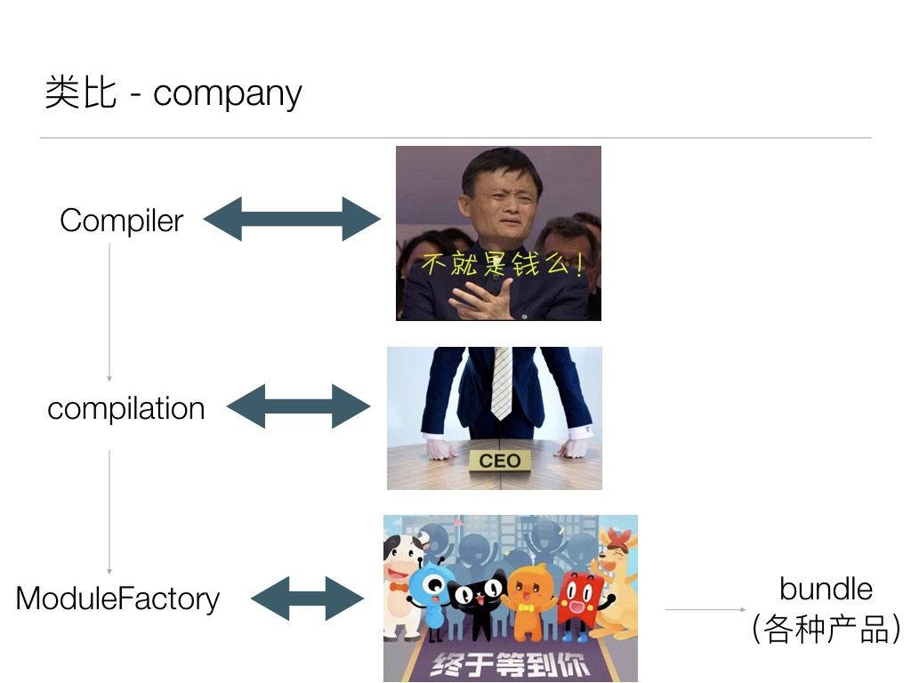
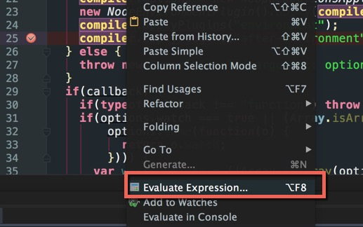
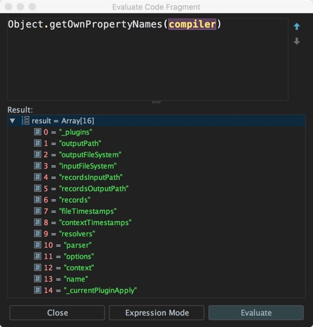
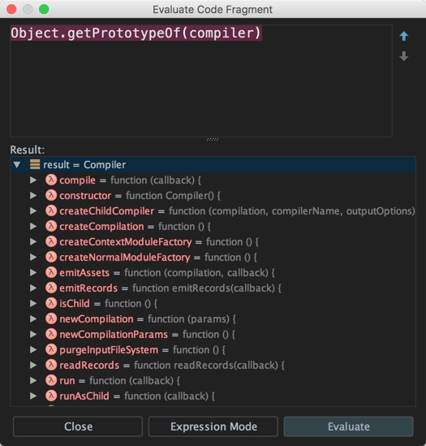
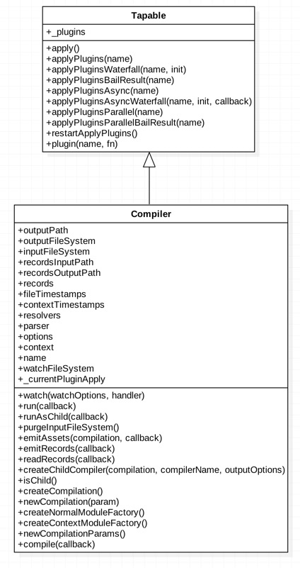
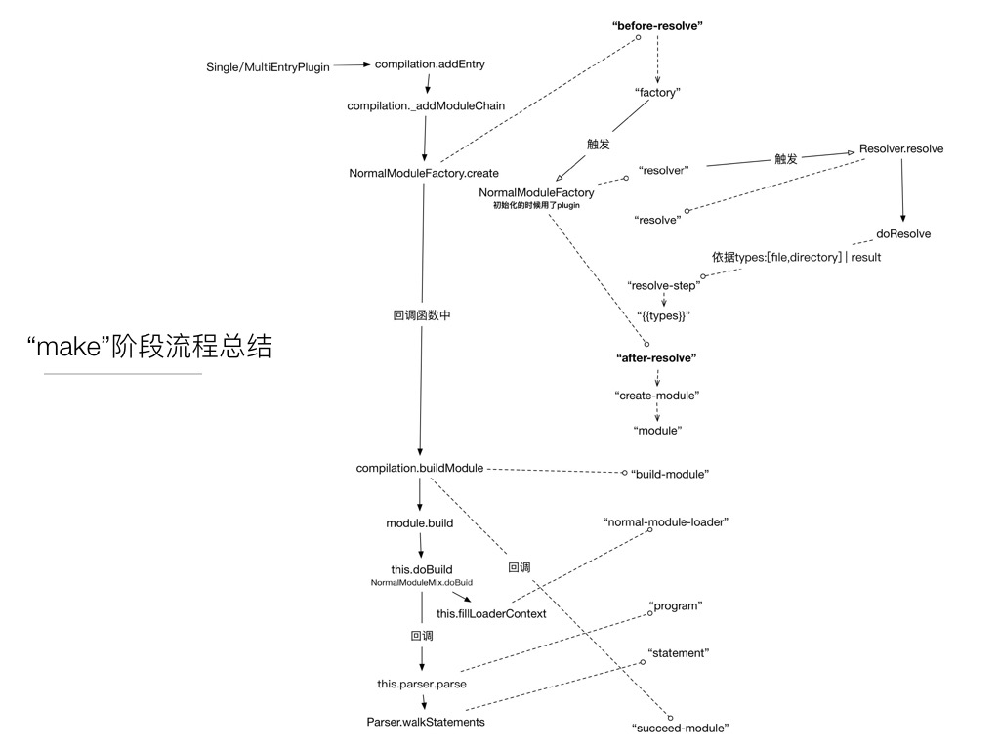
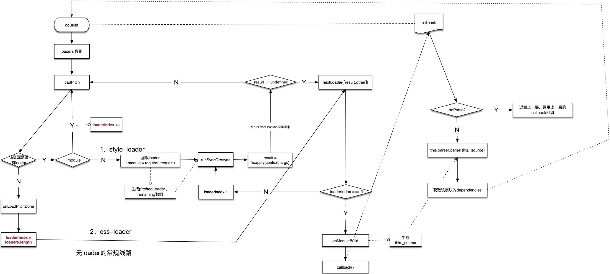

# [Webpack 源码（二）—— 如何阅读源码](https://segmentfault.com/a/1190000008060484)

 

## 1、如何调试阅读源码

如果想要了解 Webpack 的流程，只要阅读“1.细说webpack之流程篇”所述的内容就够了，讲解地比较全面了；本文就不对 Webpack 流程再做重复的描述，而是从另外一个角度补充分析 Webpack 源码；

Webpack 中最为重要的无非是 Compiler 、Compilation 、Module等对象，阅读源码的过程其实可以认为是 **了解对象的方法和属性的过程**；通读 Webpack 这个大工程的源码，以一个公司（Company）来类比，你会发现这几个对象的关系大致如下：

- **Webpack** 就是一个大公司
- **Compiler** 就像公司的董事会，只把握公司大方向的走向，不关心细节实现
- **Compilation** 就像是 CEO，由董事会任命，主要操心整个公司运行，调度各个部门运作
- **ModuleFactory** 就像各个部门了，从事打造各种产品细节
- 最终输出的 bundle 就像是具体的产品

这个类比或许有些欠妥，但也大致能展现出这个核心功能模块的位置，有个大概了解即可；

## 2、分析对象属性和方法

在源码分析中，最基本的有两点：

1. 需要分析对象本身的属性和方法
2. 分析对象之间的关系（继承、实现）等

和人的社交类似，前者回到某个人本身的属性（性别、年龄等）和功能（琴棋书画等技能），后者回答某人人的社会关系（兄弟、父子等关系）；

以 Compiler 实例为例，在 Webstorm 中我们打一个断点，右键使用 **Evalute Expression...** 功能：

获取该实例对象的属性，直接使用 `Object.getOwnPropertyNames(obj)` 获取：

使用`Object.getPrototypeOf(compiler)` 就能根据当前实例获取其原型对象，主要是关注上面定义的方法：

同时进一步分析其继承的对象，就能获知 Compiler 对象的继承关系：

到这里为止我们已经比较全面地掌握了 Compiler 对象，对源码的进一步分析打下了基础；比如在此基础上，我们可以分析上一节所述的 **make事件阶段** 过程：

以及 **loader** 加载过程：

等等其他你想了解的内容，都可以基于上面的功能分析出来，这里就不一一列举了。

正所谓四两拨千斤，找对要分析的 **对象** 以及 **它的关系网** ，就找到了正确的分析源码的方法；