## 漫画：什么是漫画动态规划？（整合版）

————————————

**题目：**

有一座高度是**10**级台阶的楼梯，从下往上走，每跨一步只能向上**1**级或者**2**级台阶。要求用程序来求出一共有多少种走法。

比如，每次走1级台阶，一共走10步，这是其中一种走法。我们可以简写成 1,1,1,1,1,1,1,1,1,1。

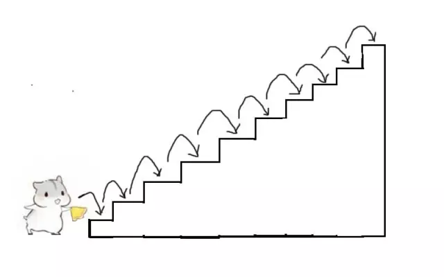

再比如，每次走2级台阶，一共走5步，这是另一种走法。我们可以简写成 2,2,2,2,2。

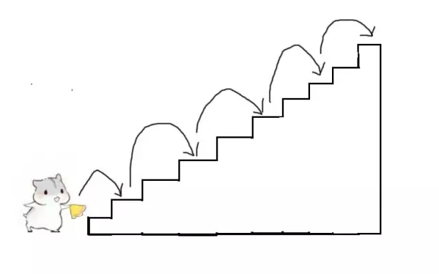

当然，除此之外，还有很多很多种走法。

————————————

**第一种情况：**

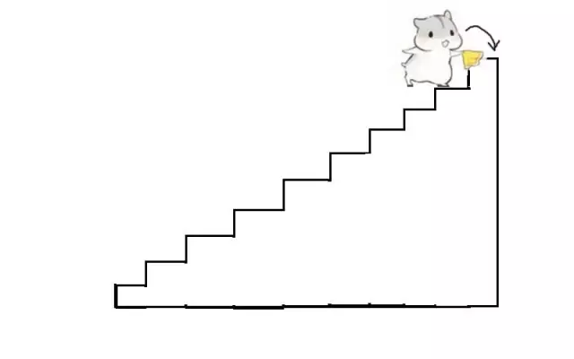

**第二种情况：**

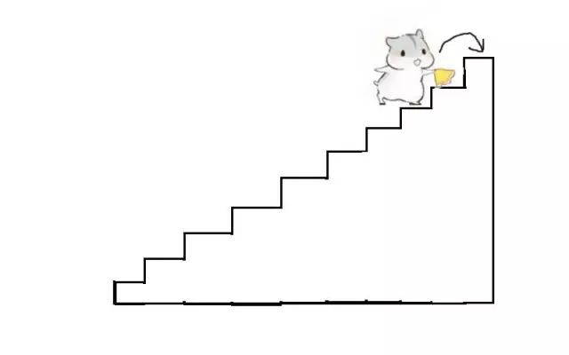

**把思路画出来，就是这样子：**

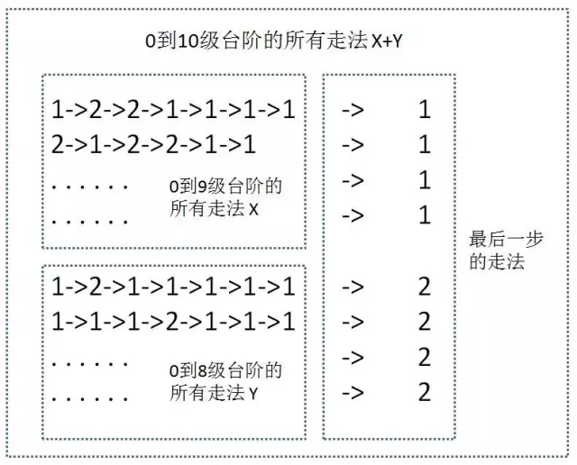

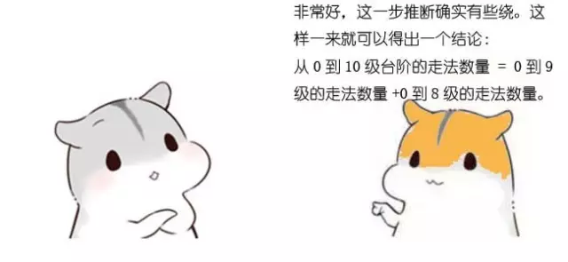

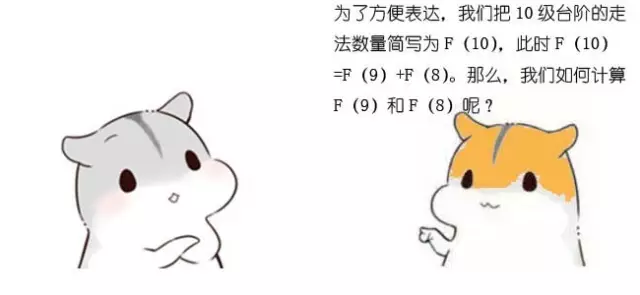

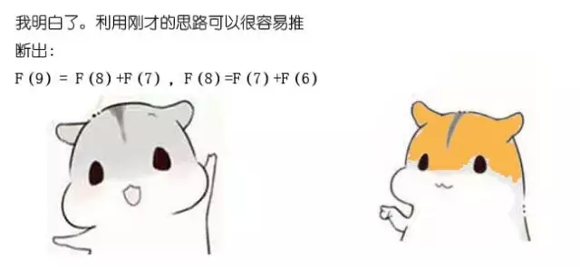

**F(1) = 1;**

**F(2) = 2;** 

**F(n) = F(n-1)+F(n-2)（n>=3）**

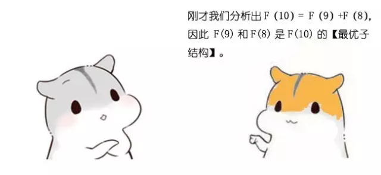

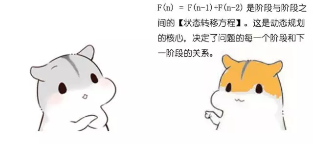

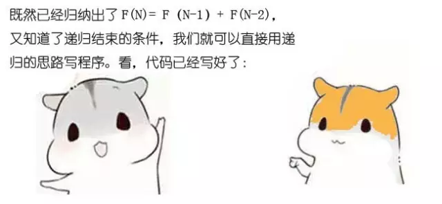

**方法一：递归求解**

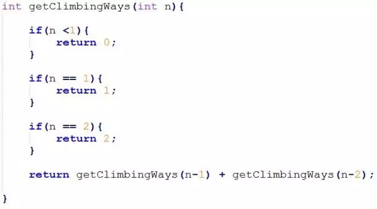

由于代码比较简单，这里就不做过多解释了。

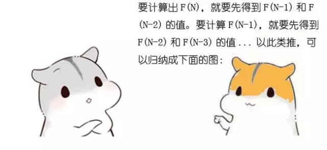

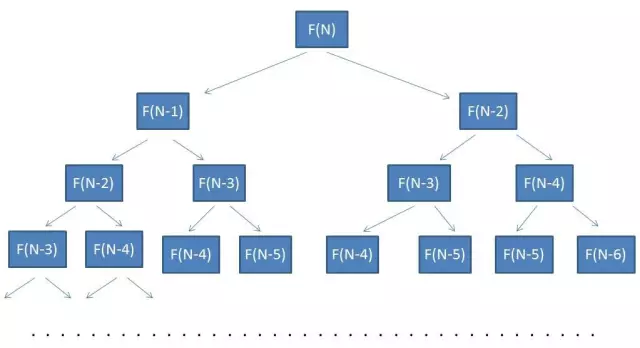

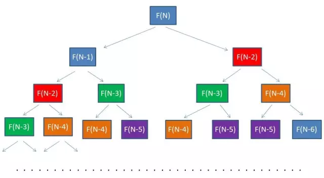

如图所示，相同的颜色代表了方法被传入相同的参数。

**方法二：备忘录算法**

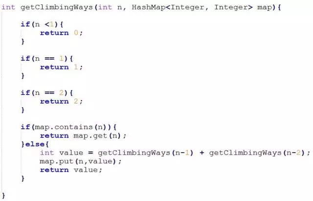

在以上代码中，集合map是一个备忘录。当每次需要计算F(N)的时候，会首先从map中寻找匹配元素。如果map中存在，就直接返回结果，如果map中不存在，就计算出结果，存入备忘录中。

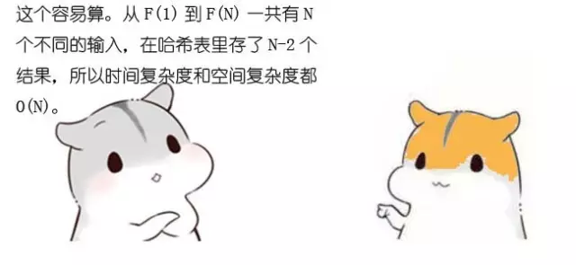

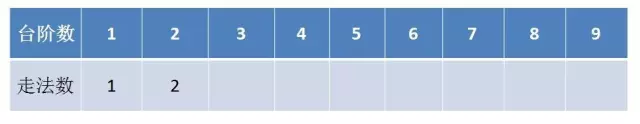

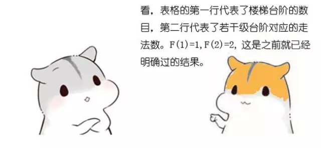

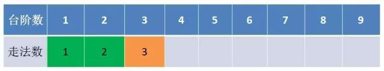

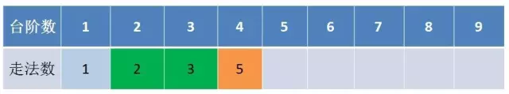

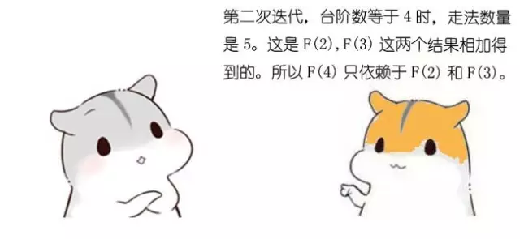

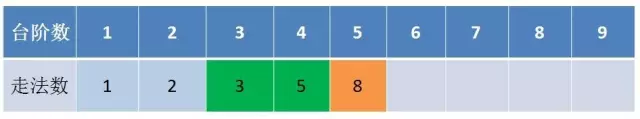

**方法三：漫画动态规划求解**

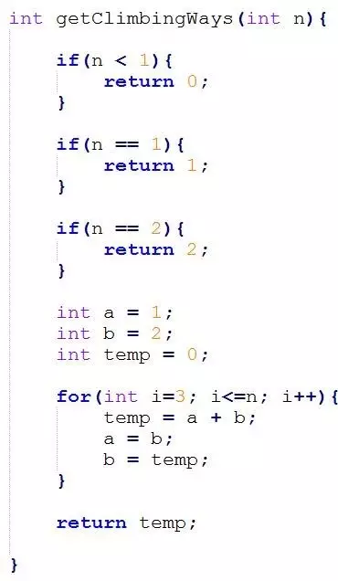

程序从 i=3 开始迭代，一直到 i=n 结束。每一次迭代，都会计算出多一级台阶的走法数量。迭代过程中只需保留两个临时变量a和b，分别代表了上一次和上上次迭代的结果。 为了便于理解，我引入了temp变量。temp代表了当前迭代的结果值。

**题目二： 国王和金矿**

有一个国家发现了5座金矿，每座金矿的黄金储量不同，需要参与挖掘的工人数也不同。参与挖矿工人的总数是10人。每座金矿要么全挖，要么不挖，不能派出一半人挖取一半金矿。要求用程序求解出，要想得到尽可能多的黄金，应该选择挖取哪几座金矿？

**方法一：排列组合**

每一座金矿都有挖与不挖两种选择，如果有N座金矿，排列组合起来就有2^N种选择。对所有可能性做遍历，排除那些使用工人数超过10的选择，在剩下的选择里找出获得金币数最多的选择。

代码比较简单就不展示了，时间复杂度也很明显，就是O(2^N)。

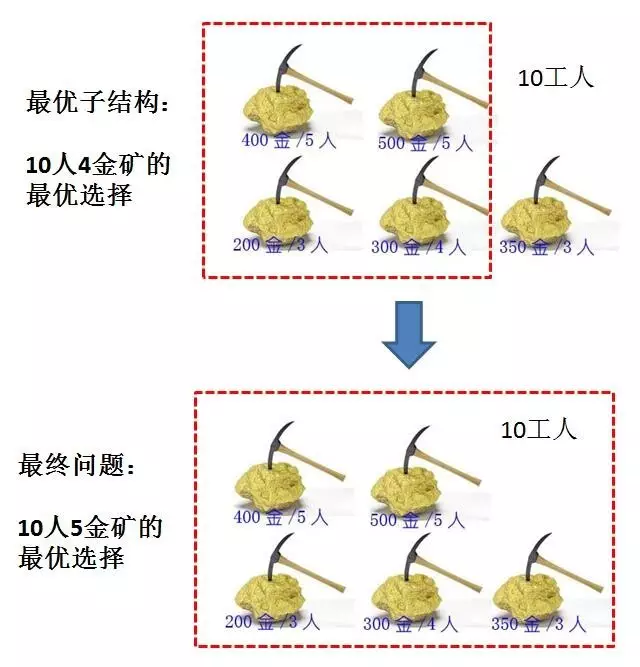

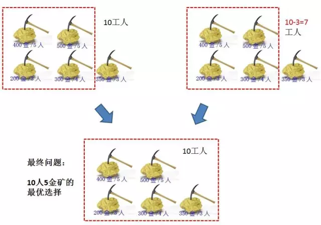

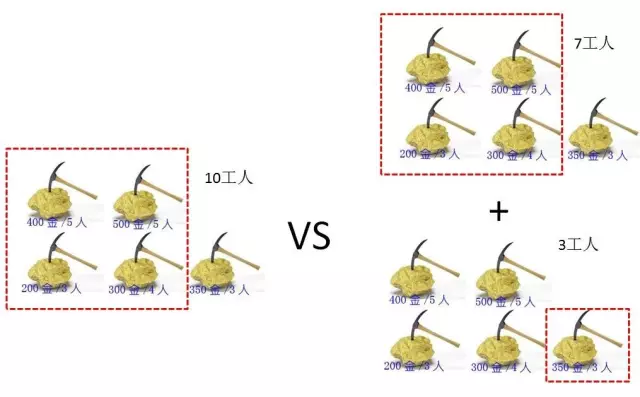

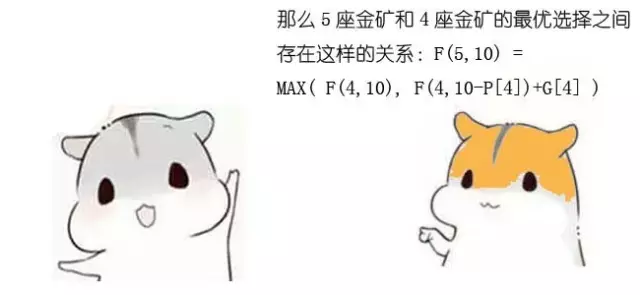

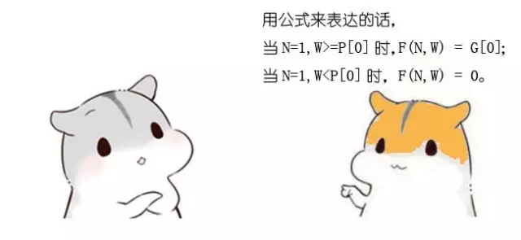

**F(n,w) = 0    (n<=1, w<p[0]);**

**F(n,w) = g[0]     (n==1, w>=p[0]);**

**F(n,w) = F(n-1,w)    (n>1, w<p[n-1])**  

**F(n,w) = max(F(n-1,w),  F(n-1,w-p[n-1])+g[n-1])    (n>1, w>=p[n-1])**

其中第三条是补充上去的，原因不难理解。

**方法二：简单递归**

把状态转移方程式翻译成递归程序，递归的结束的条件就是方程式当中的边界。因为每个状态有两个最优子结构，所以递归的执行流程类似于一颗高度为N的二叉树。

方法的时间复杂度是O(2^N)。

**方法三：备忘录算法**

在简单递归的基础上增加一个HashMap备忘录，用来存储中间结果。HashMap的Key是一个包含金矿数N和工人数W的对象，Value是最优选择获得的黄金数。

方法的时间复杂度和空间复杂度相同，都等同于备忘录中不同Key的数量。

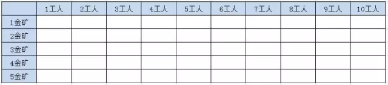

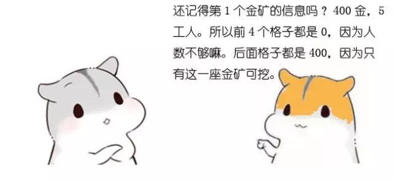

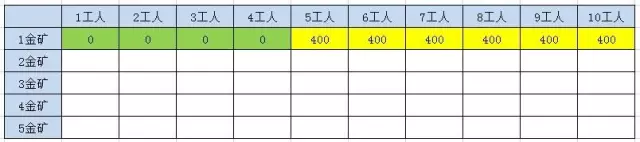

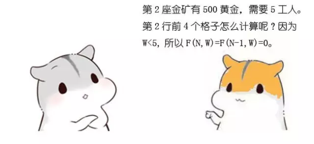

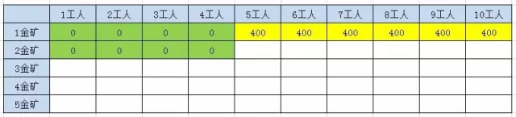

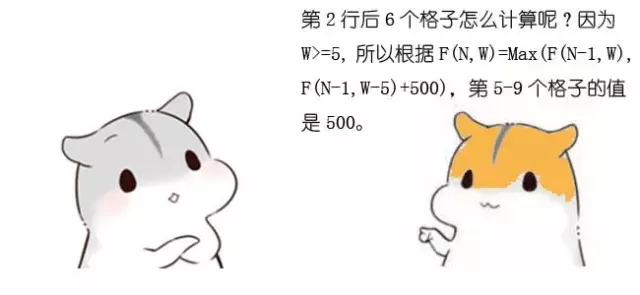

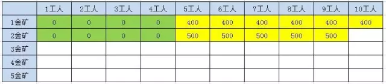

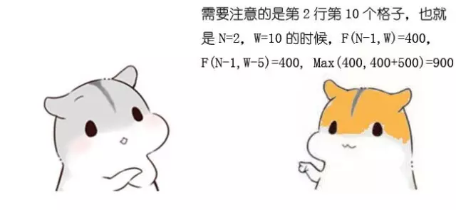

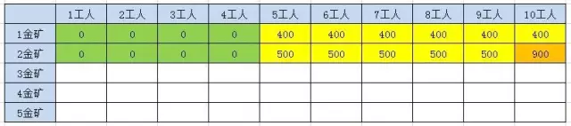

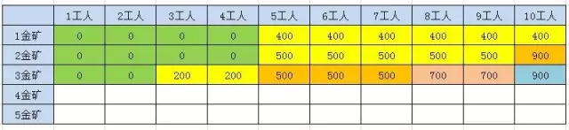

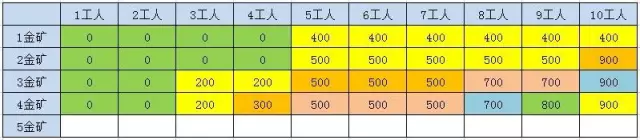

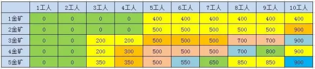

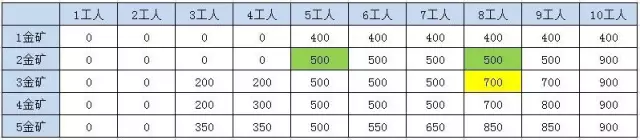

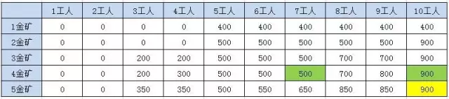

**方法四：漫画动态规划**

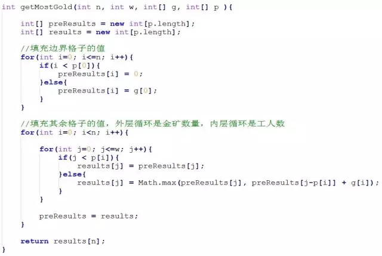

方法利用两层迭代，来逐步推导出最终结果。在外层的每一次迭代，也就是对表格每一行的迭代过程中，都会保留上一行的结果数组 preResults，并循环计算当前行的结果数组results。

方法的时间复杂度是 O(n * w)，空间复杂度是(w)。需要注意的是，当金矿只有5座的时候，漫画动态规划的性能优势还没有体现出来。当金矿有10座，甚至更多的时候，漫画动态规划就明显具备了优势。

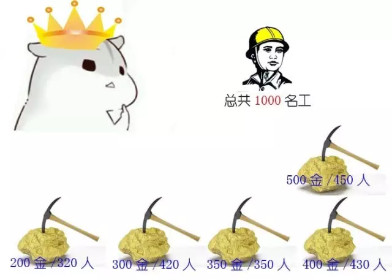

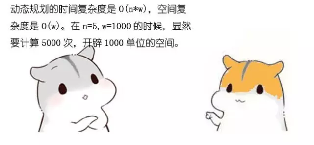

—————END—————